<center><h1> Nerdvana Cancer 2026 </center>

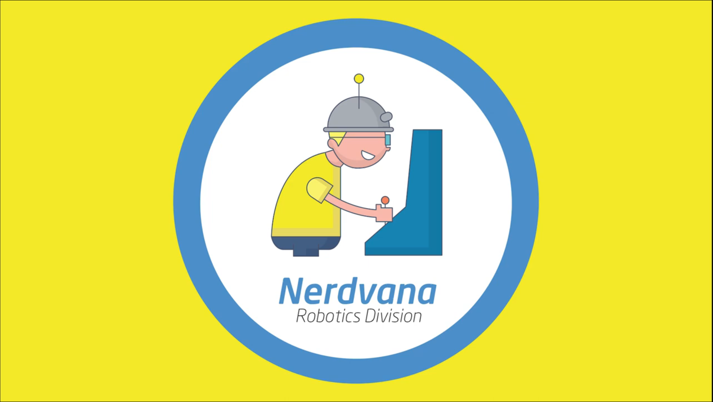

[](https://nerdvana-edu.ro)

This repository contains the documentation for the Nerdvana Cancer team's robot for the 2026 World Robot Olympiad Future Engineers competition. The robot, was designed and built by a team of three students.

## Table of Contents
* [The Team](#team)
* [The Challenge](#challenge)
* [The Robot](#robot-image)
* [Performance Video](#video)
* [The Team's Evolution Over the Years](#team-evolution)
  * [2022 Paula (Pretty Awesome Ultra Low Accurate robot) - International (Germany) - 8th Place](#2022-international)
  * [2023 Paula Mia (Pretty Awesome Ultra Low Accurate Minimum Intelligence Augmentation) - National - 1st Place](#2023-national)
  * [2023 Paula Mia 2 (Pretty Awesome Ultra Locomotion Autonomous Mapping Intelligence Augmentation) - International (Panama) - 17th Place](#2023-international)
  * [2024 TBD - National - 1st Place](#2024-national)
  * [2024 MOOYA (Mechanized Optimization for Outstanding Yield and Adaptation) - International (Turkey) - 7th Place](#2024-international)
  * [2025 MOOYA* (Mechanized Optimization for Outstanding Yield and Adaptation) - National - 1st Place](#2025-national)
  * [2025 L.A.C.H.E. (Lightweight Autonomous Carbon-Hybrid Entity) - International](#2025-international)
  * [2026 M.D.S (Memory, Dead-reckoning & Steering) - Current Robot](#2026-current)
* [Mobility Management](#mobility-management)
  * [Powertrain](#powertrain-mechanical)
    * [Drivetrain](#drivetrain-mechanical)
    * [Motor](#motor-mechanical)
    * [Motor Driver](#motor-driver-mechanical)
  * [Steering](#steering-mechanical)
    * [Servo Motor](#servo-motor)
  * [Chassis](#chassis-mechanical)
* [Power and Sense Management](#power-and-sense-management)
  * [Li-Po Battery](#li-po-battery)
  * [Arduino Nano ESP32](#arduino-nano-esp32)
  * [IMU](#imu-sensor)
  * [OpenMV Cam H7 R2](#openmv-cam-rt1062)
  * [Voltage Regulator](#voltage-regulator)
  * [PCB Design](#pcb)
  * [Circuit Diagram](#circuit-diagram)
* [Code for each component](#code-for-each-component)
  * [Drive Motor](#drive-motor-code)
  * [Servo Motor](#servo-motor-code)
  * [Camera](#camera-code)
  * [IMU](#gyro-sensor-code)
* [Obstacle Management](#obstacle-management)
  * [Qualification Round](#quali-management)
  * [Final Round](#final-management)
  * [Additional code](#additional-code)
* [What We Changed This Year](#whats-new)
  * [Tuning and telemetry over WiFi](#wifi-dashboard)
  * [A drift-free gyro that finds its own straight](#self-straight)
  * [Our own localization and route memory](#self-localization)
  * [Rethinking the parking](#smart-parking)
  * [Where this is heading](#next-steps)
* [Robot Construction Guide](#robot-construction-guide)
  * [Step 0: Print the 3D parts](#3d-printing)
  * [Step 1: Assemble the steering system](#steering-system-assembly)
  * [Step 2: Assemble the powertrain](#powertrain-assembly)
  * [Step 3: Attach the electronics](#electronics-attachment)
  * [Step 4: Upload the code](#code-upload)
* [Cost Report](#cost-report)
  * [3D Printing Costs](#3d-printing-costs)
  * [Other Parts Tested](#other-parts-tested)
  * [Tools and Equipment](#tools-and-equipment)
  * [Summary of Costs](#summary-of-costs)
* [Randomizer](#randomizer)
* [Resources](#resources)
  * [3D Models](#3d-models-resources)
  * [Images](#images-resources)
* [License](#copyright)

---

## The Team <a class="anchor" id="team"></a>


### Priboi Luca Mihai
<p align="center">
  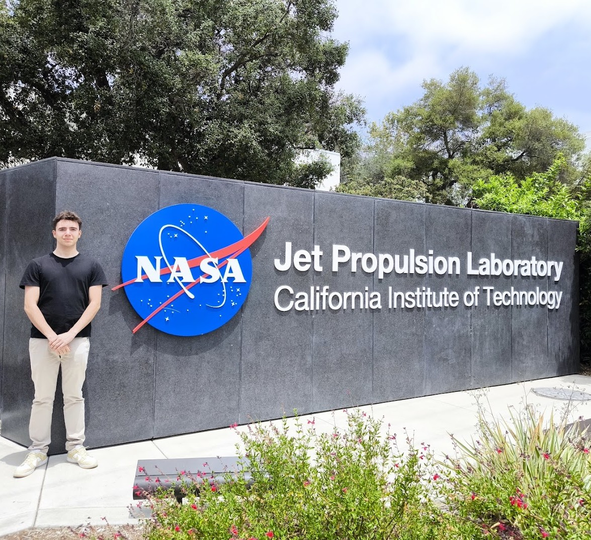
</p>

<b>Age:</b> 20

<b>University:</b> 2nd year, Politehnica University of Bucharest

<b>Description:</b> Hello! I am Mihai! I've been participating at WRO since 2015 and I am very excited to be part of the Nerdvana Romania team. My academic passions are programming, physics and robotics, but I also enjoy playing the piano 🎹, whatching movies 🎬, traveling ✈️ and Formula 1 🏎️🏁.

---

### Bălan Teodor Ovidiu
<p align="center">
  
</p>

<b>Age:</b> 20

<b>University:</b> 2nd year, University of Bucharest

<b>Description:</b> Wassup y'all! My name is Teodor, and I love traveling and experiencing new things. Since I was a kid, I've always been drawn to solving puzzles, playing basketball, discovering new inventions, and thinking of creative ways to do things. Also, I know how to do a backflip. 🤠

---

### Orășeanu Andrei
<p align="center">
  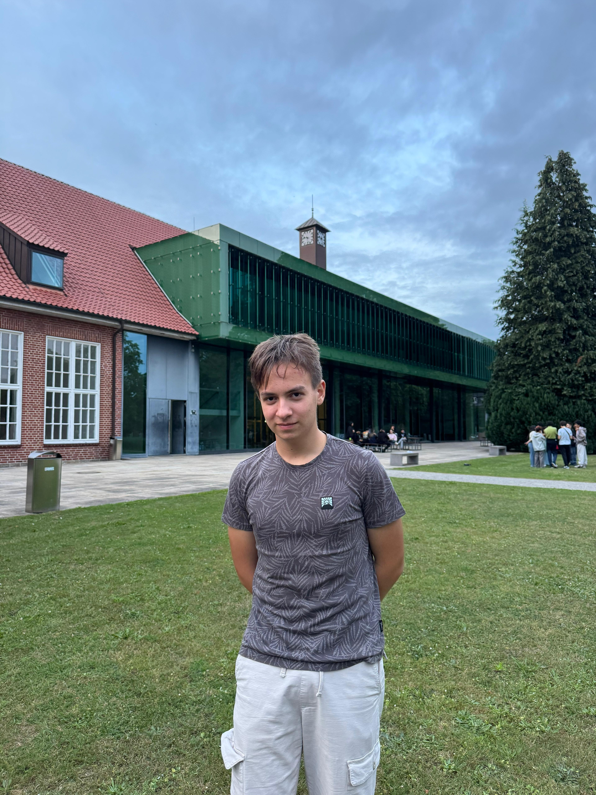
</p>

<b>Age:</b> 17

<b>School:</b> 11th grade, Colegiul Național Gheorghe Șincai

<b>Description:</b> Hello! I'm Andrei, and I've been part of WRO since 2023. What pulled me in from the very first season was the part where you build something with your own hands and then have to teach it to think for itself, that moment when the robot finally does the thing on its own never gets old. My main passions are robotics and physics, but outside the workshop I love traveling ✈️, a long game of chess ♟️, and playing basketball 🏀. I joined the team this year wanting to push our self-driving car further than we ever have, and so far it's been exactly the kind of challenge I was hoping for.

---

### Priboi Maria Marcela
<p align="center">
  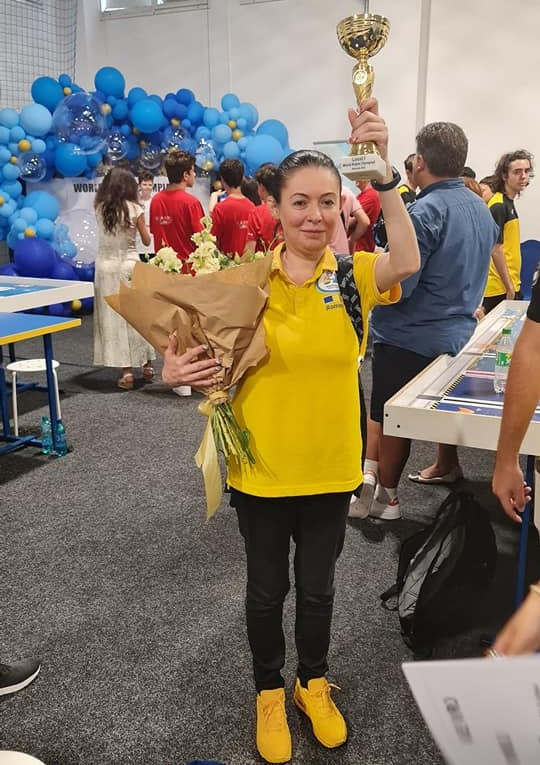
  <p align="center">Nerdvana Romania Founder</p>
</p>

<b>Role:</b> Coach

<b>Description:</b> I am a very ambitious person, I like to work hard and to be involved in many projects. I am a very organized person and I like to have everything planned. I am a very sociable person and I like to communicate with people. I am a very responsible person and I like to take care of everything that is happening around me. I am a very creative person and I like to come up with new ideas. I am a very determined person and I like to achieve my goals.

## The Challenge <a class="anchor" id="challenge"></a>

The **[WRO 2026 Future Engineers - Self-Driving Cars](https://wro-association.org/)** challenge invites teams to design, build, and program a robotic vehicle capable of driving autonomously on a racetrack that changes dynamically for each round. The competition includes two main tasks: completing laps while navigating randomized obstacles and successfully performing a precise parallel parking maneuver. Teams must integrate advanced robotics concepts such as computer vision, sensor fusion, and kinematics, focusing on innovation and reliability.

This challenge emphasizes all aspects of the engineering process, including:
- **Mobility Management:** Developing efficient vehicle movement mechanisms.
- **Obstacle Handling:** Strategizing to detect and navigate traffic signs (red and green markers) within specified rules.
- **Documentation:** Showcasing engineering progress, design decisions, and open-source collaboration through a public GitHub repository.

Points are awarded based on performance in the challenge rounds, quality of the engineering documentation, and the ability to create an innovative and robust solution. The goal is to inspire STEM learning through real-world robotics applications, teamwork, and creative problem-solving.

Learn more about the challenge [here](https://wro-association.org/wp-content/uploads/WRO-2026-Future-Engineers-Self-Driving-Cars-General-Rules.pdf).

## Photos of our robot M.D.S (the proven L.A.C.H.E. chassis) <a class="anchor" id="robot-image"></a>

|  |  | 
| :--: | :--: | 
| *Front* | *Back* |
|  |  | 
| *Left* | *Right* |
|  |  | 
| *Top* | *Bottom* |

<br>

## Our video of the robot on [Youtube](https://www.youtube.com/watch?v=aLT0-nPUaAE) <a class="anchor" id="video"></a>

<br>

# Our Team's Evolution Over the Years <a class="anchor" id="team-evolution"></a>

We have been participating in the Future Engineers category since 2022, the first year it was introduced in Romania. While our team has seen some changes in membership over the years, we have consistently worked together to build on our experiences. Throughout this time, we have grown and evolved, both in our skills and in our approach to robotics, developing increasingly sophisticated strategies and designs with each competition.

| 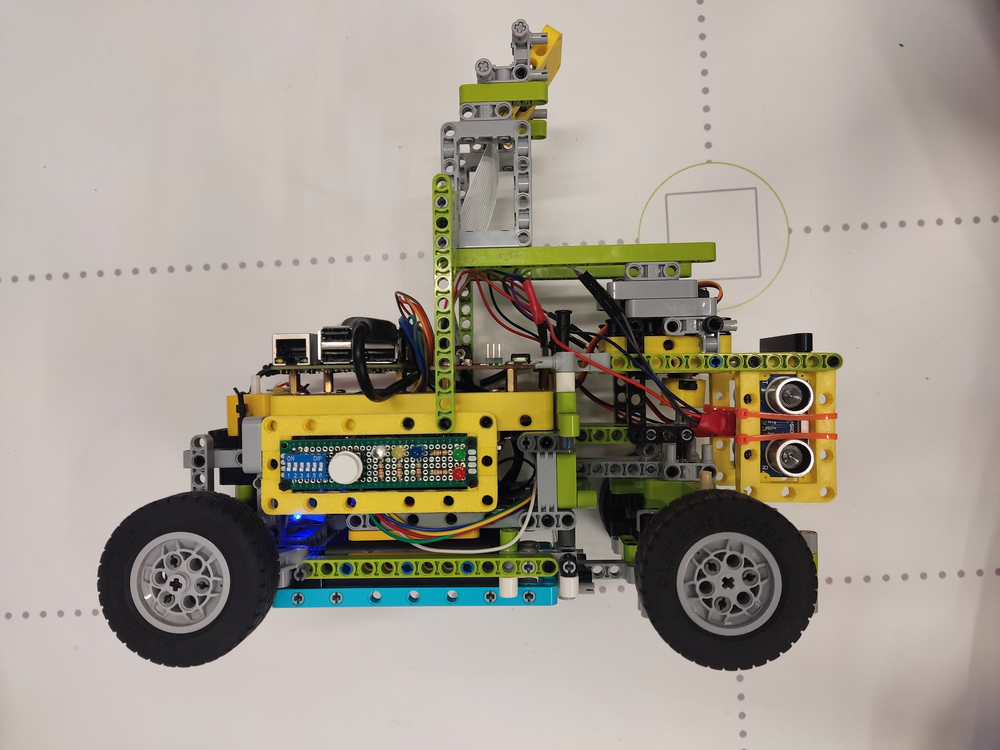 | 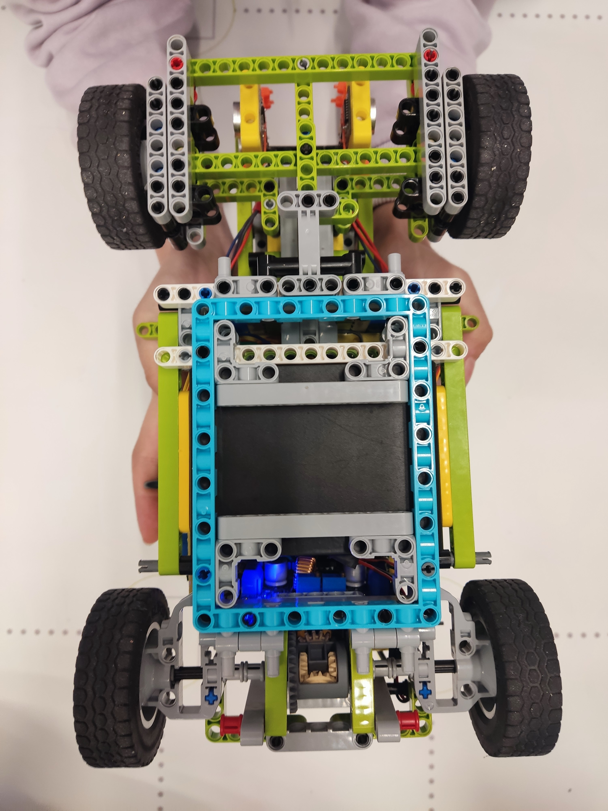 |
| :--: | :--: |
| *2022 National Competition* |
| 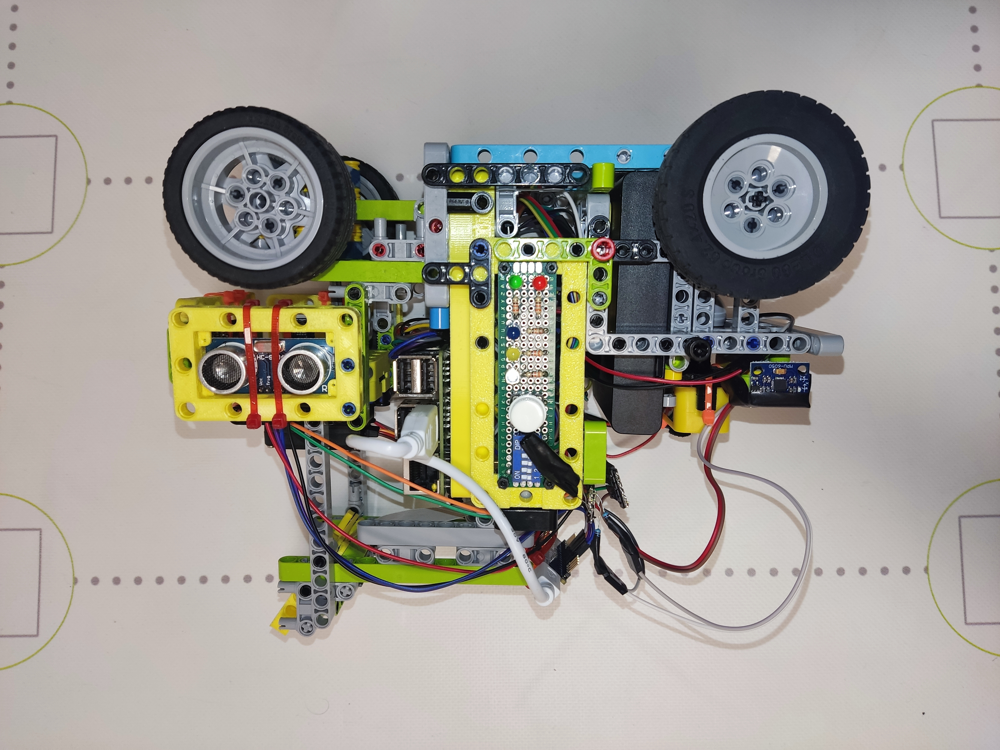 | 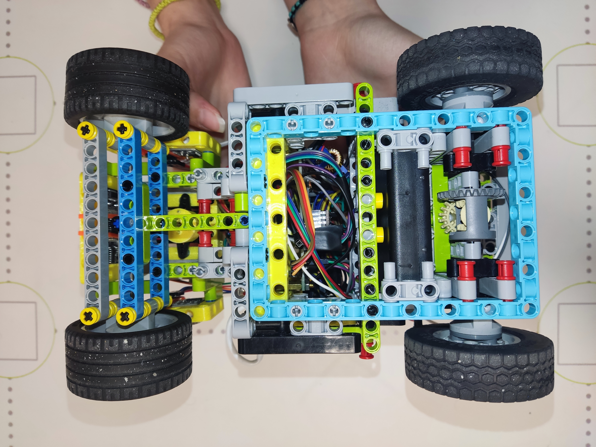 |
| *2022 International Competition* |
| 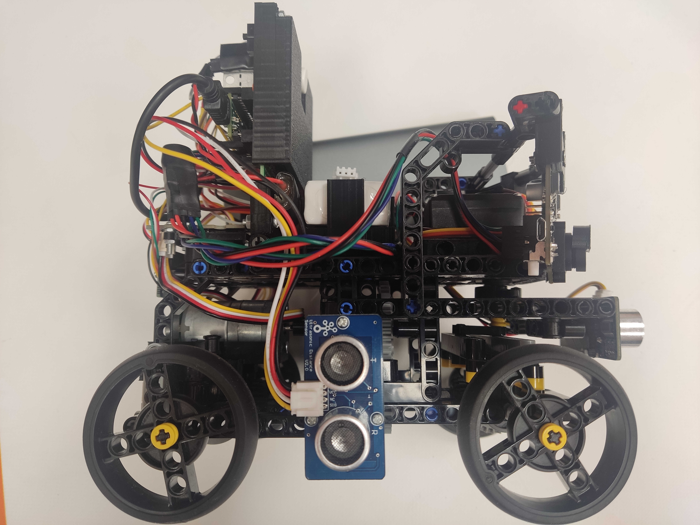 | 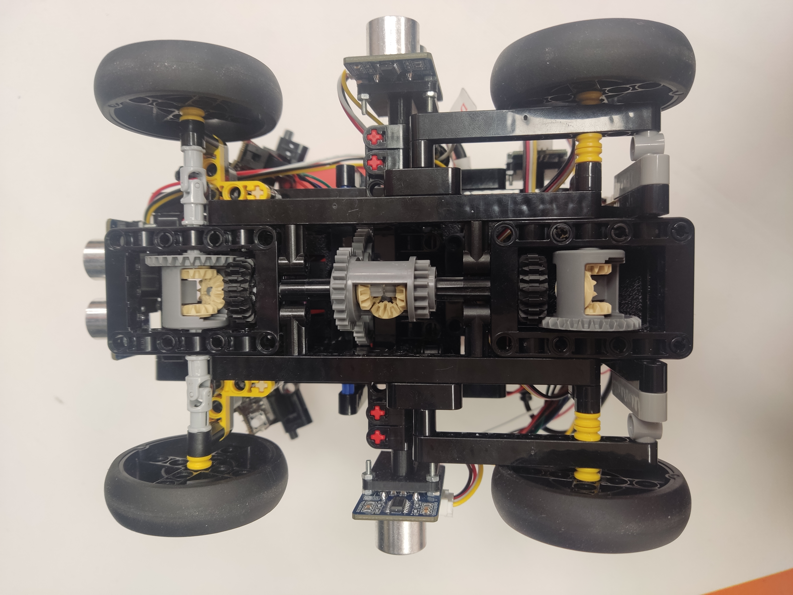 |
| *2023 National Competition* |
| 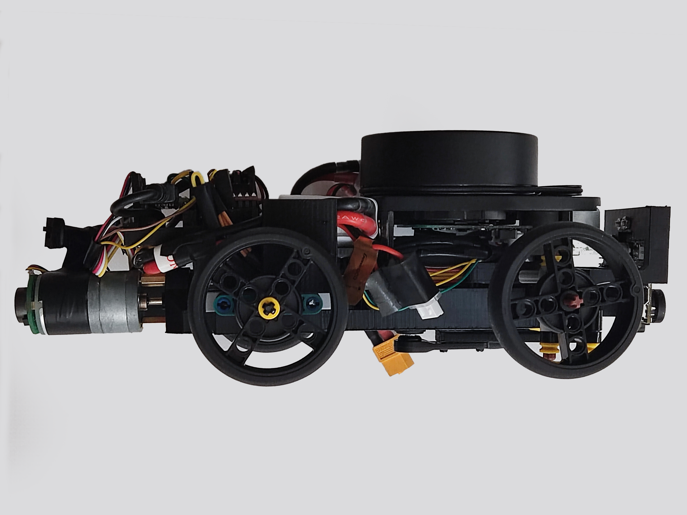 | 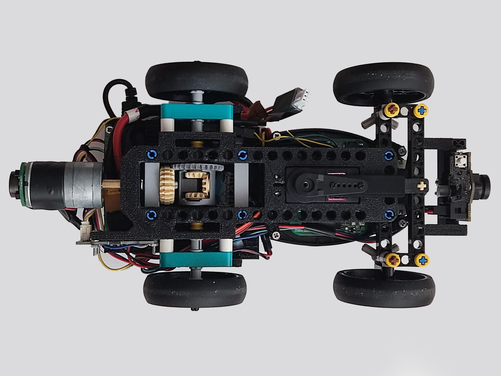 |
| *2023 International Competition* |
| 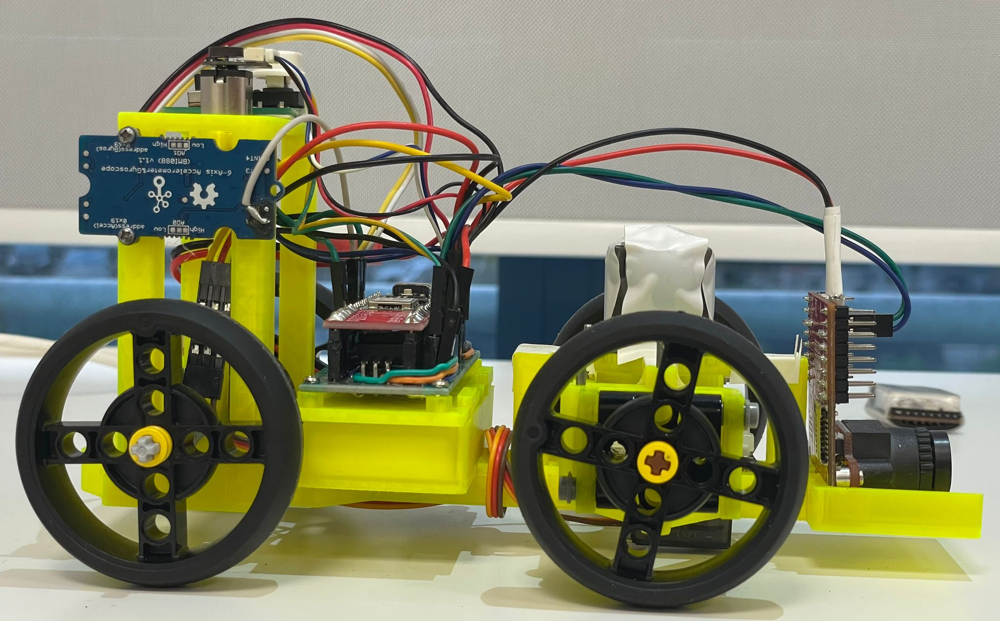 | 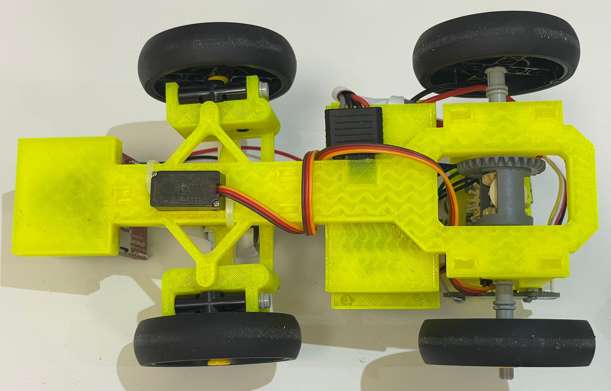 |
| *2024 National Competition* |
|  |  |
| *2024 International Competition* |
|  |  |
| *2025 National Competition* |
|  |  |
| *2025 International Competition* |
|  |  |
| *2026 Season — same chassis, new software (M.D.S)* |

## 2022 (No Name) - National - 1st Place <a class="anchor" id="2022-national"></a>
Our first robot, built for the 2022 Future Engineers competition, was a large, bulky, and mostly Lego-based design, building on our previous experience with RobotMission (which was exclusively Lego Mindstorms). We experimented with adding more advanced components, including a Raspberry Pi 3 with a Pi Camera for object detection, a non-Lego motor and servo, and an Arduino to handle the electronics interface. The Raspberry Pi and Arduino communicated through a custom handshake, and we added ultrasonic sensors for wall and object detection.

3D printing was used minimally, mainly to hold components in place, with some parts even “floating” on cables. Cabling was improvised, using standard-length mother-to-mother wires without much organization. Power was supplied by a small battery pack holding six AAA rechargeable cells. Overall, it was a beginner-level robot: heavy, slow, and cumbersome, with limited processing power and a program that was challenging to run efficiently. At this stage, it did not yet have a name, unlike our later tradition of giving each robot an identity.

## 2022 Paula (Pretty Awesome Ultra Low Accurate robot) - International (Germany) - 8th Place <a class="anchor" id="2022-international"></a>
The idea was mostly the same as our first robot: a Lego-heavy build, but much sturdier than the flimsy predecessor. Electronics were upgraded with a faster Arduino Nano Every, and we added another ultrasonic sensor at the front for wall detection going forward, along with a bigger, stronger servo. The steering system was still imprecise, the motor remained slow, and cables were everywhere (classic “spaghetti style”).

Perhaps the biggest change was the addition of an MPU6050 gyro, which significantly improved driving straight and performing precise maneuvers, a component we would keep in our designs going forward (though we later found even better options).

Despite the imperfections, with a lot of hard work, some fair bit of luck, and sheer motivation, we managed to rank 8th place. Looking back, as we would see in the following year, the other teams were just as inexperienced, but learning quickly, a reminder that Future Engineers is as much about growth as competition.

## 2023 Paula Mia (Pretty Awesome Ultra Low Accurate Minimum Intelligence Augmentation) - National - 1st Place <a class="anchor" id="2023-national"></a>
This robot was a major tipping point for us. The base and powertrain were still Lego, but nothing like before. They were rigid, smaller, and efficient, using only what was necessary. Mechanically, this is probably my favorite robot, and the most distinct one.

We implemented an AWD system with three differentials (front, back, and a middle differential actuated directly by the motor), which was bigger, more powerful, and faster than before. The camera was upgraded to a PixyCam, removing the need for the Raspberry Pi and allowing the Arduino to handle the input from the trained camera. Crucially, we added two cameras at angles, giving us large coverage of the map.

Electrically, this was a huge leap. We moved from messy cables everywhere to a prototyping board that organized all components, with dedicated, custom-made cables to reach detached components. We also added small but useful features: a display to see data when not connected to a laptop, and a LiPo battery (larger capacity, higher voltage, lighter, smaller, and easily swappable).

Steering angle was still quite bad, and the code was complicated, messy, and hardly consistent, but the AWD system solved a major issue of losing power in turns. We also upgraded the gyro to a BMI088, which we still use today. Overall, smaller than before but still not tiny, this robot showed a significant evolution in mechanical design, electronics, and vision, laying the foundation for our future builds.

## 2023 Paula Mia 2 (Pretty Awesome Ultra Locomotion Autonomous Mapping Intelligence Augmentation) - International (Panama) - 17th Place <a class="anchor" id="2023-international"></a>
This robot brought major changes to our design. The frame was now fully 3D-printed, replacing the big, flexible Lego structure with a monocoque that was lighter, stiffer, and more compact. However, the wheels, differential, and steering system were still Lego, as printing such small components proved too brittle, introduced friction, and reduced precision (not that Lego is precise anyway).

We experimented with a 360° LiDAR, which in theory allowed us to see all walls and obstacles from any angle at any time. Our main programmer, Teo, wrote brilliant code for detecting them consistently and efficiently. The large LiDAR and its height limitations forced compromises: no AWD system this time, as fitting it alongside the LiDAR was impossible. We also reduced to a single camera, relying on the LiDAR for obstacle detection while the camera captured object color and position for tracking.

Electronics were upgraded to a much faster Teensy microcontroller, offering frequencies magnitudes higher than the Arduino Nano Every. This came with compatibility challenges and sparse documentation, but we managed to make it work. Cable management finally improved, though some wires were still visible. Steering precision improved, but not dramatically.

Going to Panama, we were confident, but color calibration issues due to lighting differences affected performance. The robot was inconsistent, and we managed the situation worse than we could have, resulting in 17th place. Meanwhile, other teams had advanced significantly with brilliant solutions we hadn't considered.

Despite the setback, this experience reinforced the essence of Future Engineers: learning, communicating, and sharing knowledge. We gained as much as we could, returned home, and immediately started designing a new, better robot, determined to surpass everything we had built before.

## 2024 TBD - National - 1st Place <a class="anchor" id="2024-national"></a>
Oops! We decided to hold off on naming our best robot yet, which resulted in forgetting to give it a proper name at the national competition :). This robot represented the culmination of everything we had learned over the previous two long (at least it felt like it) years in Future Engineers.

Design and mechanics: Lego was minimal, just for mounting the big wheels (which we had been using for a while and saw no reason to change) and the differential (still for friction reasons). Everything else was 3D-printed, modular, and lightweight, made from translucent yellow PLA, our club color. It followed the trend: smaller, lighter, faster, and fully visible, no hidden parts, random Lego pieces, oversized LiDARs, or messy cables.

Electronics and control: We returned to Arduino for better documentation and integration (though that model had firmware issues and could break easily. One could hope!). The microcontroller was an Arduino ESP32 Nano, providing speed and wireless programming capabilities (though we ended up sticking with wired uploading due to web app limitations).

Vision and sensing: We upgraded from the PixyCam to an OpenMV camera, programmable in Python, supporting object detection with machine learning, fine-tuned resolution, FPS, and exposure settings. Distance from cubes and walls was now derived directly from the camera, eliminating the need for distance sensors.

Steering and performance: We built a custom parallelogram steering system, simple but effective. But, with large wheels, a faster motor, and reduced weight, high-speed corners caused the front wheels to skid. To solve this, we added weights over the front of the body, improving friction and stability.

This robot combined all the lessons from past competitions: modularity, lightness, precision, speed, and simplicity. It was the first design where everything we wanted actually came together, setting the stage for our international competition robot later that year.

## 2024 MOOYA (Mechanized Optimization for Outstanding Yield and Adaptation) - International (Turkey) - 7th Place <a class="anchor" id="2024-international"></a>
This was the same base as our previous national robot (finally with a proper name), with the focus shifting mostly to code refinement. We worked on making the program as efficient and reliable as possible, but mechanical challenges persisted.

Despite being quite light (~300 g), the robot still skidded in high-speed corners. To counteract this, we added weights over the front wheels to improve grip, which caused the rear to lift during acceleration. Adding rear weight again shifted the problem to the front: a vicious cycle. Ultimately, the robot reached almost 600 g, and we also switched to PLA-CF filament (PLA with carbon fibers) for increased strength, which helped the thin steering pieces survive the competition.

Performance at Istanbul ranked us 7th place. It wasn't our highest potential, and while saying we were "disappointed" might be too strong, we were definitely not fully satisfied. Skidding, imprecise steering, and camera issues from auto-exposure and other settings prevented us from performing as well as in testing. This experience highlighted exactly what we needed to focus on for the next edition: minimizing skidding, improving steering precision, and resolving camera reliability issues.

## 2025 MOOYA* (Mechanized Optimization for Outstanding Yield and Adaptation) - National - 1st Place <a class="anchor" id="2025-national"></a>
For the national competition, we used the same robot with targeted upgrades. The OpenMV camera was replaced with a newer, more powerful model, offering higher resolution, faster FPS, and additional options for object detection. Its microcontroller was upgraded as well, improving processing speed and reliability.

With these changes, we were confident that previous camera issues would be resolved. Other mechanical and design aspects remained the same, allowing us to focus on fine-tuning and testing while simultaneously developing the next-generation robot. This strategy ensured we could maximize performance at the national level while preparing for the next step in our evolution.

## 2025 L.A.C.H.E. (Lightweight Autonomous Carbon-Hybrid Entity) - International <a class="anchor" id="2025-international"></a>
Following the trend of evolution, our current robot is smaller, faster, more precise, and highly custom-made. Every aspect of the design reflects lessons learned from previous years.

Mechanical design:
- Fully 3D-printed drivetrain and frame using PLA-CF for strength and rigidity.
- Smaller Pololu wheels, chosen for better adherence, lower center of gravity, and compact size.
- Differential and minimal Lego parts retained only where friction made it advantageous.
- Total weight: 220 g, achieving excellent speed without any skidding.

Electronics:
- Designed a custom PCB, replacing previous prototyping boards and making the system more integrated and reliable.
- Custom cables with snap-in headers ensure correct orientation and prevent shorts or miswiring (no more accidental mistakes like in earlier designs).
- The camera is detached and easily repositionable along all axes (horizontal, vertical, and rotation) within seconds, avoiding hours of redesign like before.
- Microcontroller and wiring optimized for minimal weight and maximum performance.

Performance:
- Lightweight and compact, yet mechanically robust.
- Steering and drivetrain tuned for high-speed precision, eliminating skidding problems from previous robots.
- The robot's modularity allows for quick component swaps and adjustments.

This robot represents the culmination of four years of experience: compact, fast, lightweight, and precise. With improved electronics, optimized mechanics, and programmable vision, it's now up to us to make the best of it in the next competitions.

## 2026 M.D.S (Memory, Dead-reckoning & Steering) - Current Robot <a class="anchor" id="2026-current"></a>
This season we did something we'd never done before: we left the robot alone. L.A.C.H.E. was the first build where the mechanics genuinely weren't the thing holding us back, the drivetrain is smooth, the Ackermann steering is precise, the weight sits where we want it, so re-printing the whole thing just to say we changed something felt like fixing what wasn't broken. Every robot photo in this repository is still that exact chassis, and the construction guide below still builds it part for part.

What changed is the part you can't really photograph. This year's car is L.A.C.H.E.'s body running a completely reworked brain, and that's the reason it earns its own name. **M.D.S** stands for the three ideas that brain is built around: **M**emory, we record the line we drive so we can replay a good lap instead of reacting to every corner from scratch; **D**ead-reckoning, the robot now tracks its own position on the mat from the gyro and the encoder; and **S**teering, the car calibrates its own dead-straight trim from real driving data instead of us dialing it in by hand. It also fits the challenge nicely, a self-driving car that drives from memory and knows where it stands.

All of it is written up in detail in [What We Changed This Year](#whats-new): a drift-free 1000 Hz gyro, a steering center the robot finds on its own, live tuning over WiFi, and the start of our own on-board localization. The short version is that the hardware is the same proven L.A.C.H.E., and the whole of this season went into teaching it to actually know where it is and to drive a line it has already learned.

# Mobility Management <a class="anchor" id="mobility-management"></a>

The robot's mobility is managed by a combination of components, including the powertrain, steering system, and chassis. These elements work together to ensure the robot's smooth and efficient movement.

## Powertrain <a class="anchor" id="powertrain-mechanical"></a>

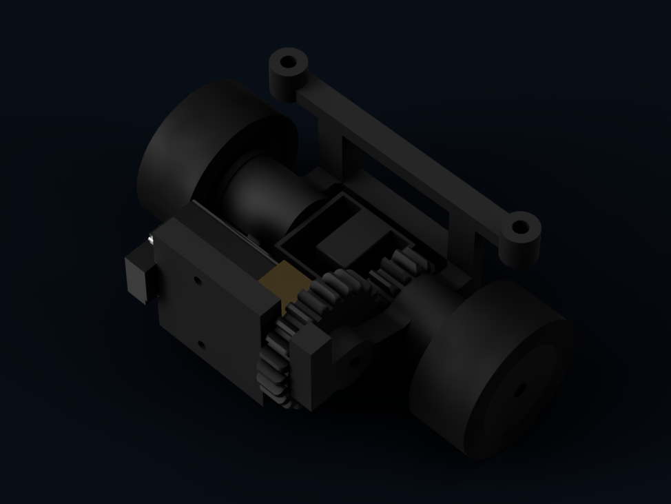

Between the motor and the wheels, there is a 1:2 gear ratio drivetrain that increases the speed of the robot while reducing the torque. This setup allows the robot to reach higher speeds on the track, which is essential for completing laps quickly. It's made by using a 24 teeth gear connected to the motor axle, which drives a 12 teeth gear attached to the differential input axle.

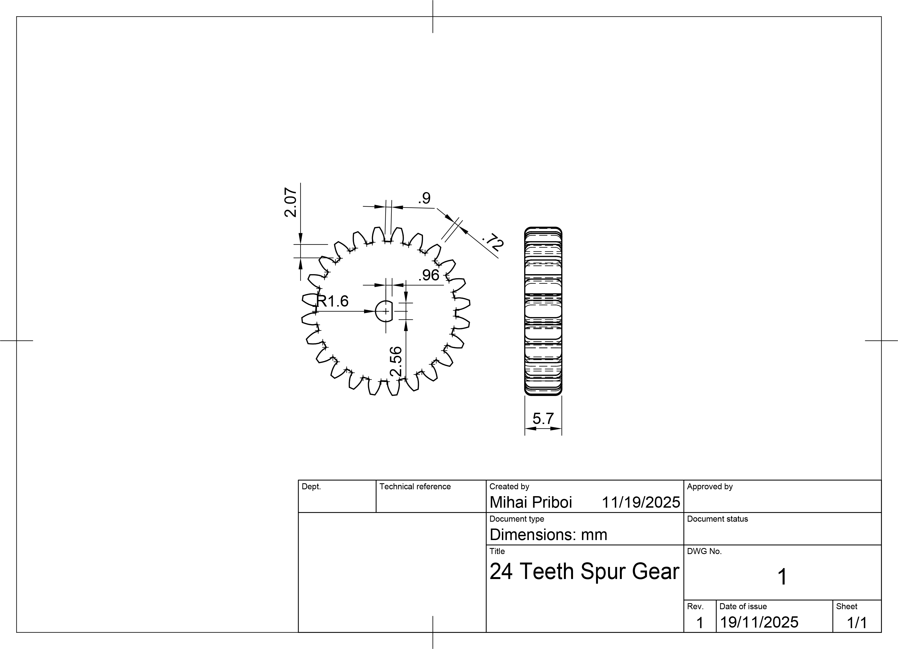

For the differential we used the work of @COPERNICON_359779 on printables.com https://www.printables.com/model/344703-lego-micro-diff-compact-modular-design/files under Creative Commons - Public Domain.

### Drivetrain <a class="anchor" id="drivetrain-mechanical"></a>
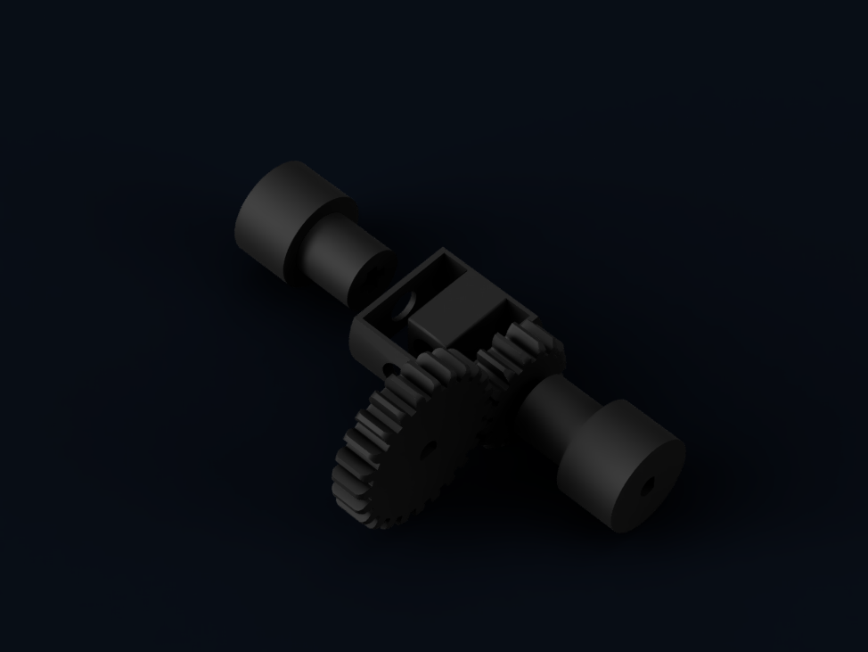

To minimize friction and maximize speed, the drivetrain combines the best of our previous Lego experience with a fully custom, precision-controlled layout. Although most structural elements are now 3D-printed, we still use two Lego axles, but only to connect with the three small internal gears of our custom 3D-printed differential. This keeps the extremely low friction and reliability of Lego's small internal gears while allowing the outer housing, tolerances, and geometry to be fully customized.

Because we transitioned to Pololu wheels, we designed a custom connector that converts the Lego axle interface to a 3 mm D-shaft, ensuring a perfectly centered, secure fit. This allowed us to retain the low-friction Lego internal gear system while benefiting from the superior grip, reduced weight, and lower rotational inertia of Pololu wheels.

The entire drivetrain is tightly enclosed inside the chassis, which was designed around it with minimal clearance. This enclosure reduces backlash, eliminates unnecessary play, and guarantees consistent alignment of the gears and axles. Every internal sliding surface is sanded, bringing friction down to nearly zero and allowing the robot to maintain high speed without compromises in stability or precision.

The result is our most efficient drivetrain yet, compact, lightweight, smooth, and engineered to take full advantage of every bit of power the motor provides.

<br>

**Potential Improvements**:
- Upgrade to a more precise metal differential for smoother turning, which would also remove the need for Lego axles.

### Motor <a class="anchor" id="motor-mechanical"></a>

<table>
  <tr>
    <td width="50%" style="text-align: left;">
      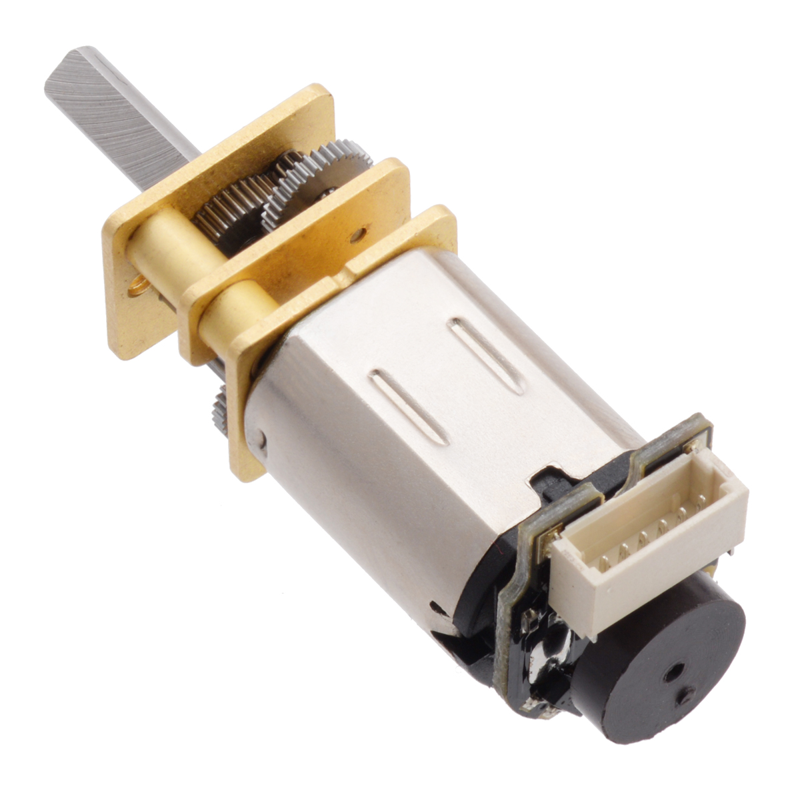
    </td>
    <td width="50%" style="text-align: left; vertical-align: top;">
      <h3>Specifications:</h3>
      <li>Voltage: 12V</li>
      <li>Gear Ratio: 30:1</li>
      <li>Speed: 1100 ± 31% rpm</li>
      <li>Torque: 0.39 ± kg·cm</li>
      <li>Weight: 9.5g</li>
      </li>
    </td>
  </tr>
</table>

Following an evaluation of different motors, we settled on a micro DC gear motor on which we attached a magnetic encoder. This motor was selected for its lightweight and compact design, which stands out among others with comparable output. Additionally, the magnetic encoder offers greater precision than its optical counterpart. We secured the motor to the chassis using a Pololu white plastic mounting bracket. As for the wheels, we used Solarbotics RW2i Wheel (internal set screw), which are 28mm diameter wheels with a 3mm D-shaft, rubber tread, and 12.7mm width, which provides excellent traction on the competition surface.

<table>
  <tr>
    <td width="33%" style="text-align: left;">
      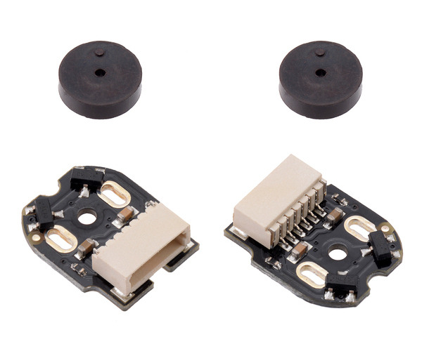
    </td>
    <td width="33%" style="text-align: left; vertical-align: top;">
      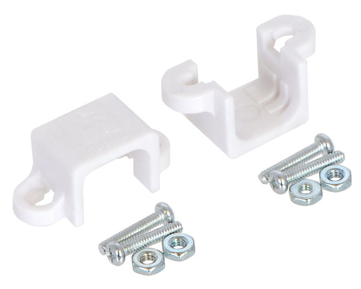
    </td>
    <td width="33%" style="text-align: left; vertical-align: top;">
      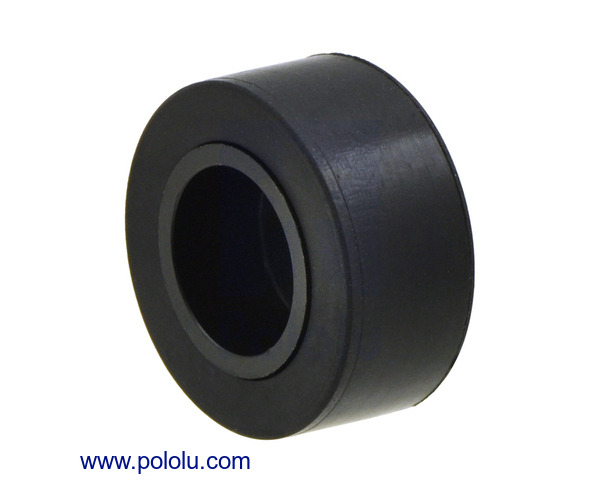
  </tr>
</table>

Where to buy the motor: https://www.pololu.com/product/3039
Where to buy the encoder: https://www.pololu.com/product/4761
Were to buy the motor bracket: https://www.pololu.com/product/1086
Where to buy the wheels: https://www.tme.eu/ro/details/pololu-1127/accesorii-pentru-robotica-si-rc/pololu/?brutto=1&currency=RON&gad_campaignid=10591401989

<br>

**Potential Improvements**:
- Consider upgrading to a brushless motor for higher efficiency and better thermal management.
- Explore batery solutions that can provide higher voltage to the motor for increased speed and torque.

### Motor Driver <a class="anchor" id="motor-driver-mechanical"></a>

<table>
  <tr>
    <td width="50%" style="text-align: left;">
      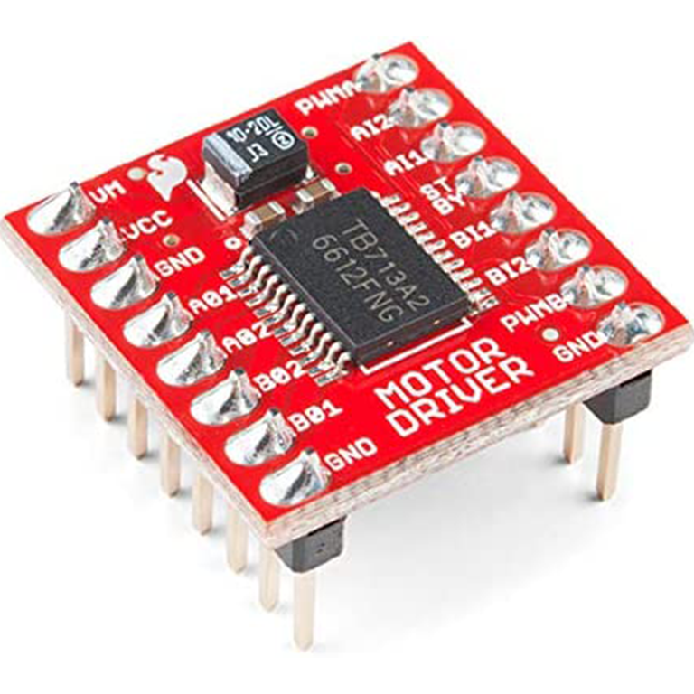
    </td>
    <td width="50%" style="text-align: left; vertical-align: top;">
      <h3>Specifications:</h3>
      <li>Power supply voltage: VM = 15V max, VCC = 2.7--5.5V</li>
      <li>Output current: Iout = 1.2A (average) / 3.2A (peak)</li>
      <li>Standby control to save power</li>
      <li>CW/CCW/short-brake/stop motor control modes</li>
      <li>Built-in thermal shutdown circuit and low-voltage detecting circuit</li>
    </td>
  </tr>
</table>

To control the speed of the drive motor, we utilized a SparkFun Dual TB6612FNG motor driver.

Where to buy the motor driver: https://www.sparkfun.com/products/14450

<br>

**Potential Improvements**:
- Replace the motor driver with a custom PCB to reduce weight and improve space utilization.
- Add active cooling or heat sinks for enhanced thermal performance during extended use.
- Explore higher-current motor drivers to accommodate potential motor upgrades.
- Implement a more robust power management system to ensure reliable operation.

## Steering <a class="anchor" id="steering-mechanical"></a>

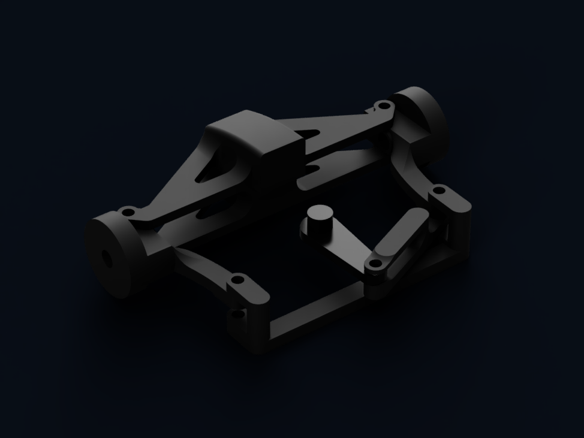

For this robot, we completely redesigned the steering system, moving away from the older parallelogram linkage and finally implementing a true Ackermann steering geometry. This upgrade allows the wheels to follow natural turning arcs, reducing slip during cornering and providing far more predictable handling at high speeds.

A major structural improvement is that the pivot point is now located inside the wheel itself, rather than outside as in previous designs. This drastically increases steering rigidity, improves response time, and eliminates a large portion of the unwanted flex that affected earlier robots.

The joints use 2 mm steel rods, which provide excellent strength-to-weight ratio and near-zero play. However, we changed the geometry of the steering linkages:
the distance between the steering pivot and the tie-rod mounting point is now significantly larger. This was done intentionally to reduce the influence of servo backlash and any free movement in the servo arms. The longer lever arm means that any tiny servo play translates into much smaller unwanted wheel rotation—greatly improving precision, especially when driving straight or making micro-adjustments.

The steering knuckles, tie rod and steering column are all custom 3D-printed and tightly integrated into the chassis. The compact design reduces weight, while the enclosed mounting ensures consistent alignment and minimal lateral movement.

Overall, this is our most precise, responsive, and stable steering system to date: lighter, smoother, and far more accurate than any previous generation.

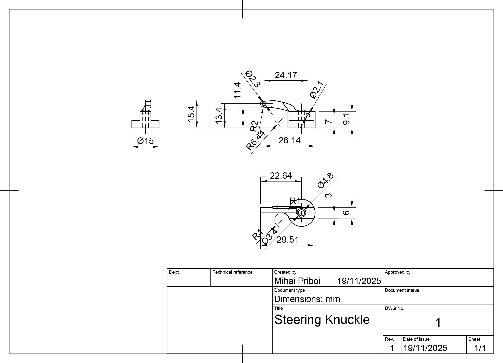

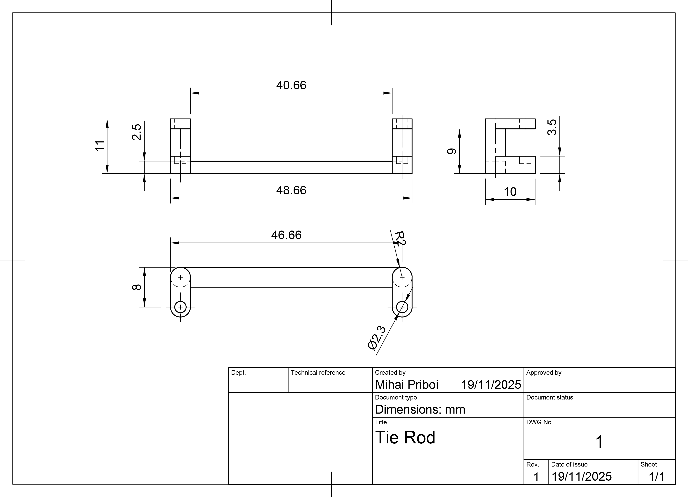

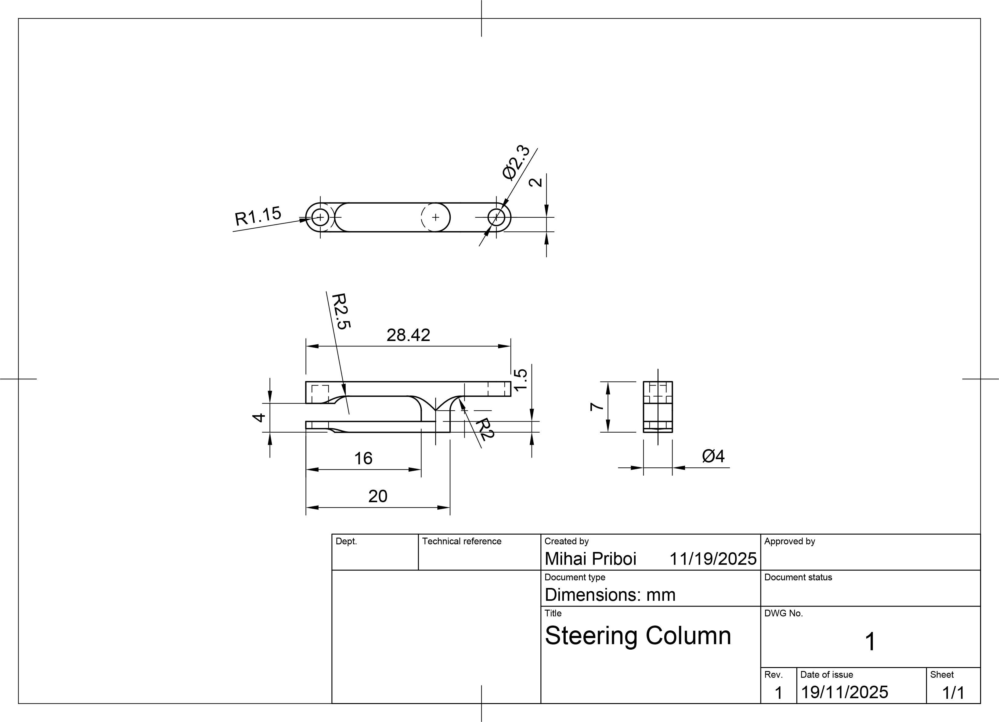

<br>

**Potential Improvements**:
- Make the steering angle wider to improve the robot's turning radius.
- Use ball-bearing joints in the linkage to reduce friction and increase durability.
- Replace the 3D-printed components with lightweight aluminum for greater strength.

### Servo Motor <a class="anchor" id="servo-motor"></a>

<table>
  <tr>
    <td width="50%" style="text-align: left;">
      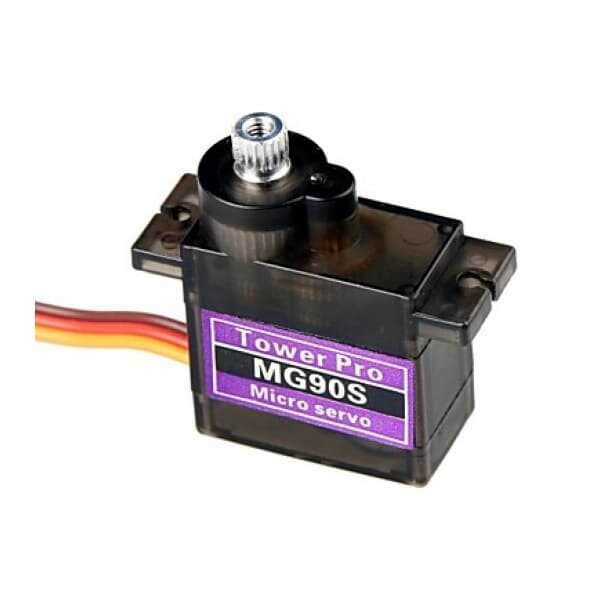
    </td>
    <td width="50%" style="text-align: left; vertical-align: top;">
      <h3>Specifications:</h3>
      <li>Weight: 13.4g</li>
      <li>Stall torque: 2.2 kgf·cm (6V)</li>
      <li>Operating speed: 0.08 s/60 degree (6V)</li>
      <li>Rotation angle: 120 degree</li>
    </td>
  </tr>
</table>

For steering, we selected the MG90S servo motor, favoring it for its high torque and swift response.

Where to buy the servo motor: https://cleste.ro/motor-servo-mg90s-180g.html

<br>

**Potential Improvements**:
- Test servos with a wider rotation angle to improve steering flexibility.
- Integrate position feedback into the servo for real-time adjustment and enhanced precision.

## Chassis <a class="anchor" id="chassis-mechanical"></a>

Over the years, our robots transitioned from bulky, Lego-dominated builds to increasingly custom and lightweight designs. This year, the chassis is now almost entirely 3D-printed, built with PLA-CF (carbon-fiber–reinforced PLA). This material choice drastically improves stiffness, reduces flex under load, and provides far better durability than traditional PLA, especially for thin steering components and structural mounts.

By redesigning every subsystem with minimalism in mind and reducing the number of individual parts, the robot became approximately 50% lighter than last year's version while also being significantly smaller and more compact. This size reduction improves handling, center of gravity, and serviceability.

The entire chassis is tightly integrated so that all drivetrain, steering, and electronic components sit securely with minimal backlash or unwanted movement.

The chassis is organized into clear functional zones:

**Rear Section:** Houses the new custom 3D-printed differential, tightly enclosed to reduce vibrations and friction.

**Central Section:** Contains a dedicated cutout for the Li-Po battery, above which the gyro is screwed in. The custom PCB is mounted above that, screwed into the chassis as well. The compact layout ensures short signal paths and extremely clean cable management.

**Front Section:** Holds the servo motor, steering assembly, and the now movable camera bracket. The camera is mounted on an adjustable multi-axis bracket, allowing quick repositioning in seconds (a task that previously required major redesigns).

Overall, this year's chassis reflects a philosophy of precision, compactness, and complete customization. Every feature, from material choice to structural layout, was designed to minimize weight, reduce friction, and maximize performance.

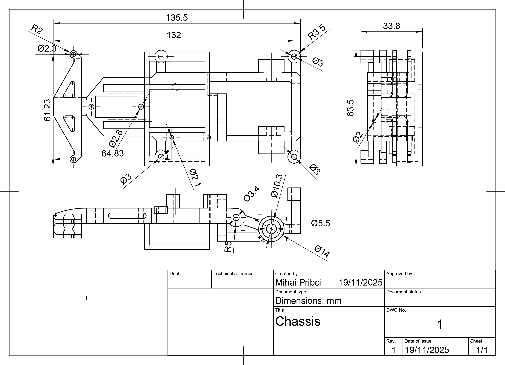

The Camera Mount is designed to be adjustable along the horizontal axis. It screws into the chassis.

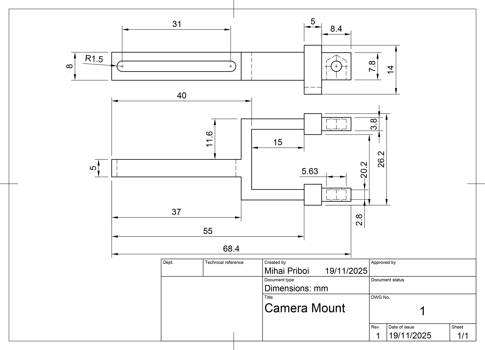

The Camera Bracket is designed to be adjustable along the vertical axis and to rotate. It screws into the Camera Mount. The OpenMV Camera lens is attached to the Camera Bracket using screws.

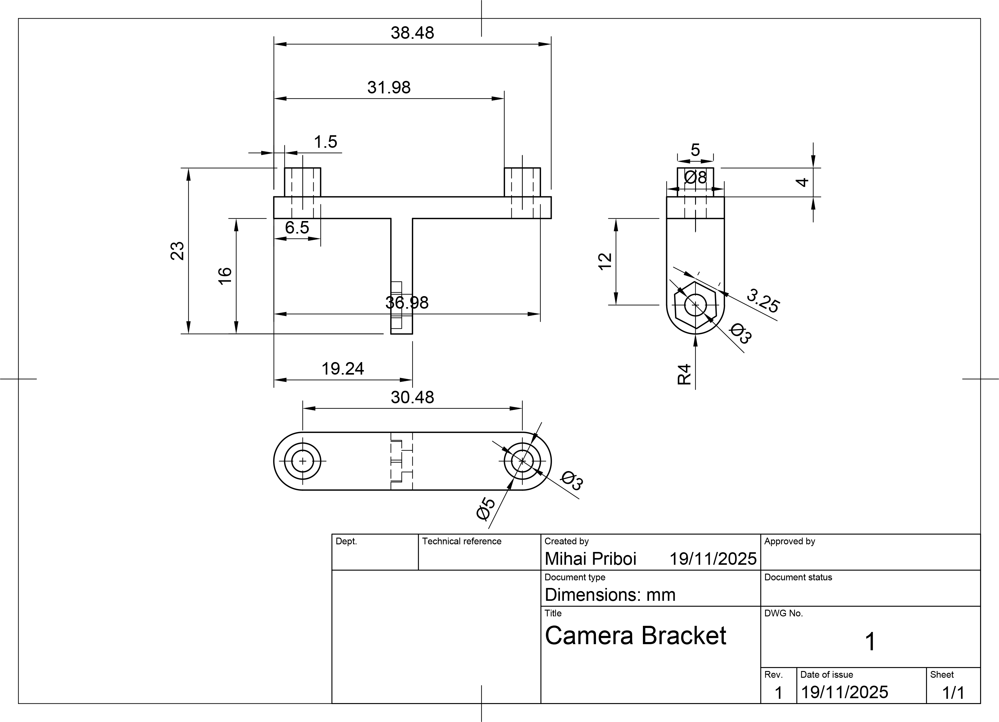

<br>

**Potential Improvements**:
- Add vibration-damping materials to minimize disturbances during operation.
- Implement a more aerodynamic shape to reduce drag and improve speed (if applicable at its speed).
- Integrate a suspension system to enhance stability when turning.
- Explore the possibility of using cnc aluminium for the chassis for improved durability.
- Add a protective cover to shield the components from dust and debris.

# Power and Sense Management <a class="anchor" id="power-and-sense-management"></a>

The robot's power and sense management system is composed of several components, including a Li-Po battery, an Arduino Nano ESP32, an IMU sensor, and an OpenMV Cam RT1062. These components work together to provide the robot with the necessary power and sensory input to navigate its environment effectively.

### Li-Po Battery <a class="anchor" id="li-po-battery"></a>

<table>
  <tr>
    <td width="50%" style="text-align: left;">
      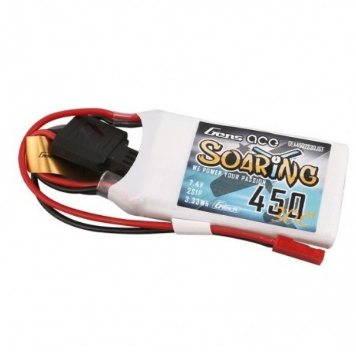
    </td>
    <td width="50%" style="text-align: left; vertical-align: top;">
      <h3>Specifications:</h3>
      <li>Capacity: 450mAh</li>
      <li>Voltage: 7.4V/2S</li>
      <li>Discharge rate: 30C</li>
      <li>Weight: 33 g</li>
      <li>Size: 56.5*31*9mm</li>
    </td>
  </tr>
</table>

Where to buy the battery: https://hpi-racing.ro/li-po-2s-74v/acumulator-lipo-gens-ace-g-tech-soaring-450mah-74v-30c-2s1p-cu-jst-syp.html

The battery is mounted using a custom 3D-printed holder, which is secured to the chassis.

<br>

**Potential Improvements**:
- Consider using a higher-capacity battery to extend runtime without increasing weight significantly.
- Add a battery management system (BMS) for better charging and discharging safety.
- Implement a battery level indicator to monitor power consumption and remaining charge.

### Arduino Nano ESP32 <a class="anchor" id="arduino-nano-esp32"></a>

<table>
  <tr>
    <td width="50%" style="text-align: left;">
      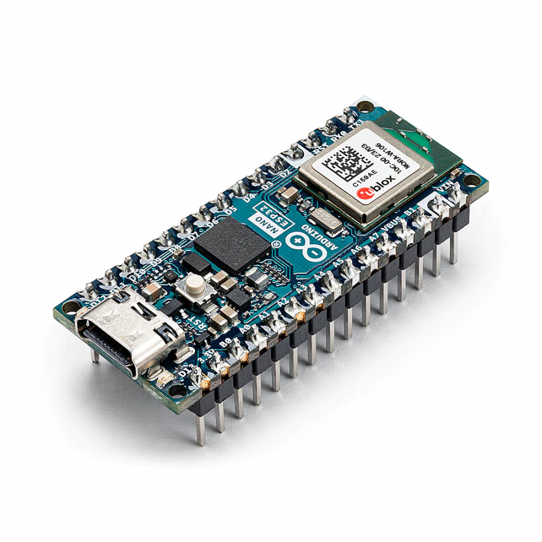
    </td>
    <td width="50%" style="text-align: left; vertical-align: top;">
      <h3>Specifications:</h3>
      <li>Microcontroller: ESP32</li>
      <li>Flash memory: 4MB</li>
      <li>SRAM: 520KB</li>
      <li>Frequency: 240MHz</li>
      <li>Pins: 22</li>
      <li>Input voltage: 5V</li>
    </td>
  </tr>
</table>

At previous competitions, we used many microcontrollers to manage the robot's various components. This year, we opted for the Arduino Nano ESP32, which combines the functionalities of an Arduino Nano and an ESP32. This microcontroller is capable of handling all of the robot's sensors and actuators, providing a more streamlined and efficient solution.

Where to buy the Arduino Nano ESP32: https://store.arduino.cc/products/nano-esp32

<br>

**Potential Improvements**:
- Test alternative microcontrollers with additional processing power or I/O pins for future scalability.

### IMU <a class="anchor" id="imu-sensor"></a>

<table>
  <tr>
    <td width="50%" style="text-align: left;">
      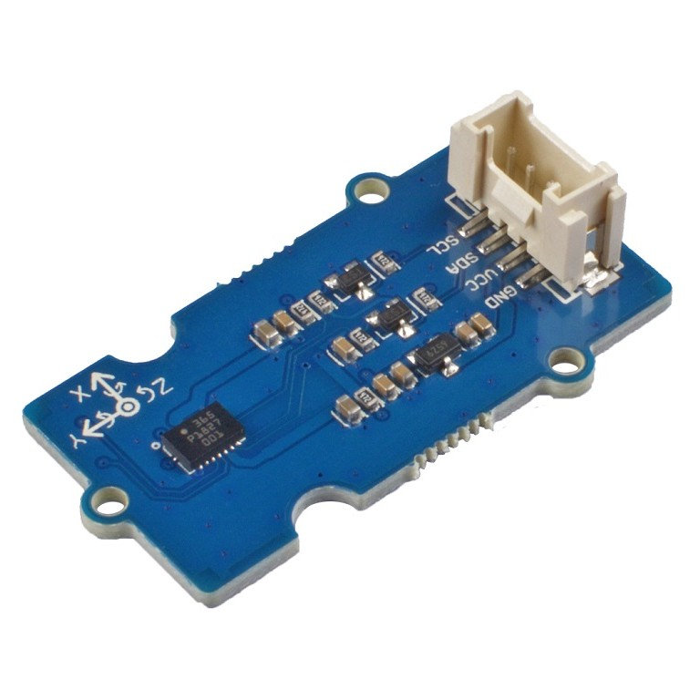
    </td>
    <td width="50%" style="text-align: left; vertical-align: top;">
      <h3>Specifications:</h3>
      <li>Gyroscope range: ±2000°/s</li>
      <li>Accelerometer range: ±24g</li>
      <li>Interface: I2C</li>
      <li>Supply voltage: 1.71V to 3.6V</li>
      <li>Current consumption: 0.9mA</li>
    </td>
  </tr>
</table>

One importat aspect that helps the robot navigate is the inertial measurement unit (IMU). This sensor is based on BOSCH BMI088, which is a high-performance IMU with high vibration suppression. While the IMU measure the angular velocity and the acceleration of the robot, we only use the angular velocity to calculate the angle of the robot. The IMU is wired to the SDA and SCL pins and a additional interrupt pin on the arduino.

Where to buy the gyro sensor: https://www.seeedstudio.com/Grove-6-Axis-Accelerometer-Gyroscope-BMI088.html

<br>

**Potential Improvements**:
- Explore alternative IMU sensors with higher accuracy and better vibration resistance.
- Implement sensor fusion with additional sensors (e.g., magnetometer) for enhanced navigation.
- Test calibration procedures to minimize drift over longer runs.

### OpenMV Cam RT1062 <a class="anchor" id="openmv-cam-rt1062"></a>

<table>
  <tr>
    <td width="50%" style="text-align: left;">
      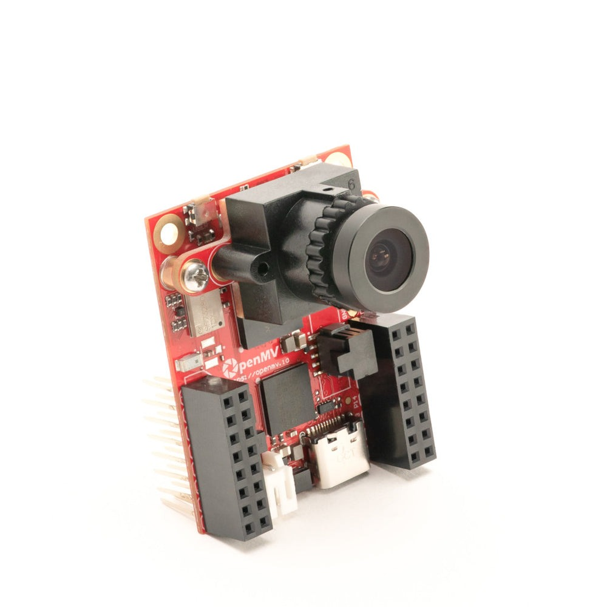
    </td>
    <td width="50%" style="text-align: left; vertical-align: top;">
      <h3>Specifications:</h3>
      <li>Processor: ARM® 32-bit Cortex®-M7 CPU w/ Double Precision FPU</li>
      <li>RAM: 32MB</li>
      <li>Flash memory: 16MB</li>
      <li>Frequency: 600MHz</li>
      <li>Resolution: 2952x1944 (5MP) and under</li>
      <li>Frame rate: 60fps</li>
    </td>
  </tr>
</table>

The OpenMV Cam RT1062 is an improvement from last year's OpenMV Cam H7 R2, in most aspects (rezolution, processing speed, camera settings possibility). The OpenMV is a high-performance camera capable of color tracking. The best feature of this camera compared to other options (like the Pixy cam) is that is has a built-in microcontroller that can process the images and send the results to the Arduino. This way, the Arduino can focus on the robot's movement and the camera can focus on the image processing.

Additionally, we implemented a real-time feedback system using wifi that displays the detected colors and calibrated values on the camera's interface. This allows us to visually verify the accuracy of the color detection and make adjustments if necessary, while the robot is running.

Together with the Arduino Nano ESP32, the camera delivers readings at approximately 60 frames per second.

In order to have the lens separated from the camera body, we used the Camera Module Extension Cable

Where to buy the OpenMV Cam RT1062: https://openmv.io/products/openmv-cam-rt
Where to buy the Camera Module Extension Cable: https://openmv.io/products/camera-module-extension-cable

<br>

**Potential Improvements**:
- Test alternative lighting solutions to improve visibility in various conditions.
- Implement advanced image processing algorithms to enhance detection accuracy.
- Use color correction algorithms: Apply color correction algorithms to compensate for any variations in lighting conditions. These algorithms can adjust the color values of the captured image to match a reference color space, making the colors more consistent and easier to calibrate.

### Voltage regulator <a class="anchor" id="voltage-regulator"></a>

<table>
  <tr>
    <td width="50%" style="text-align: left;">
      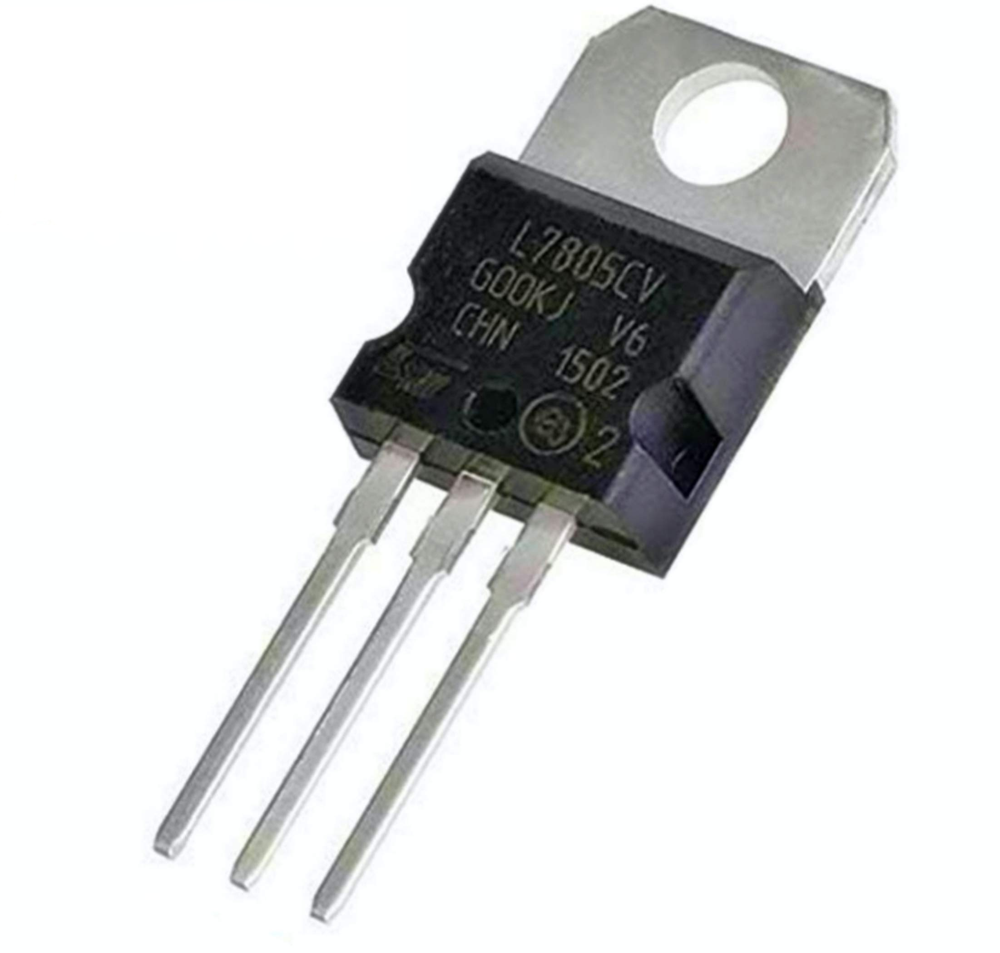
    </td>
    <td width="50%" style="text-align: left; vertical-align: top;">
      <h3>Specifications:</h3>
      <li>Input voltage: 35V max</li>
      <li>Output voltage: 5V</li>
      <li>Output current: 1.5A</li>
      <li>Thermal shutdown circuit</li>
      <li>Short-circuit protection</li>
    </td>
  </tr>
</table>

To provide the Arduino Nano ESP32 with the required 5V, we needed to decrease the output from the 7.4V battery, which can reach up to 8.4V when fully charged. We employed a linear voltage regulator, the L7805CV, capable of converting input voltages below 35V down to a steady 5V.

Where to buy the 5V voltage regulator: https://ro.mouser.com/ProductDetail/STMicroelectronics/L7805CV?qs=9NrABl3fj%2FqplZAHiYUxWg%3D%3D

<br>

**Potential Improvements**:
- Replace the linear voltage regulator with a switching regulator for better efficiency.
- Add heat sinks to the regulator for improved thermal management.

### PCB design <a class="anchor" id="pcb"></a>

The robot's PCB was designed using KiCad software. The PCB integrates the voltage regulator, headers for connecting the Arduino Nano ESP32, motor driver, and camera body directly on it. We used headers in order to make the connections modular and easy to disassemble if needed for maintenance or upgrades. The PCB also includes connectors for the battery, motor, servo, and IMU sensor.

| PCB Rendered |
| :--: |
| 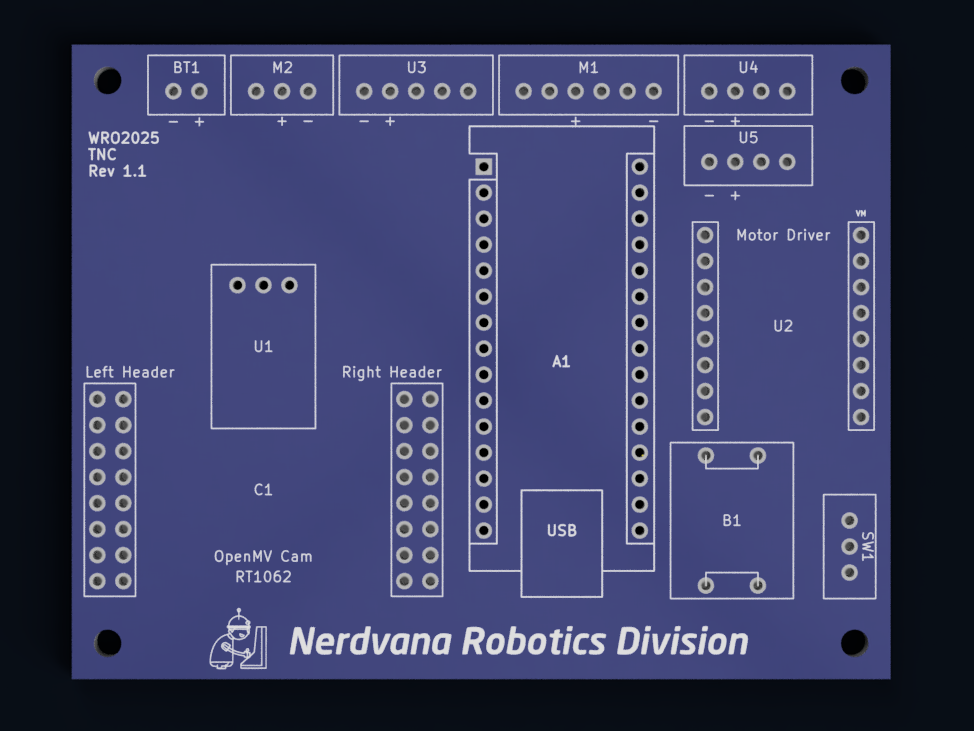 | 
| Empty PCB |
| 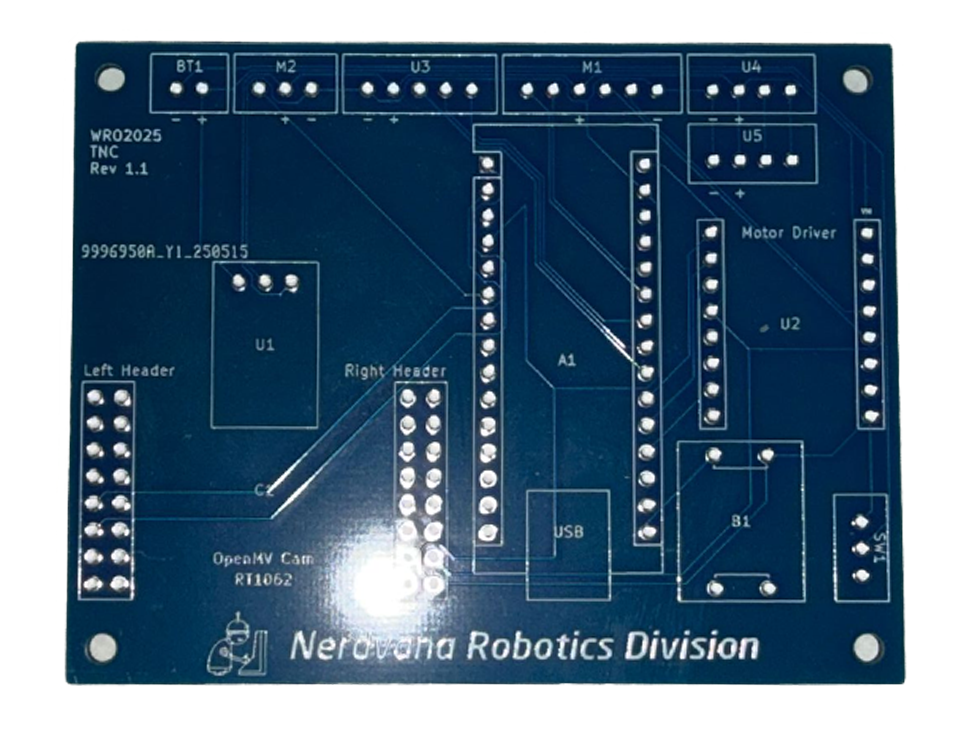 | 
| PCB |
| 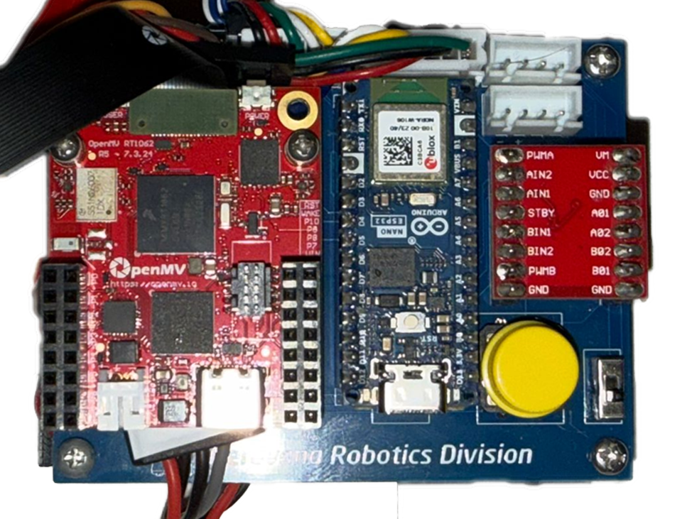 |

Where we bought the PCB: https://jlcpcb.com/

<br>

**Potential Improvements**:
- Integrate debugging points on the PCB to simplify troubleshooting.

### Circuit diagram <a class="anchor" id="circuit-diagram"></a>
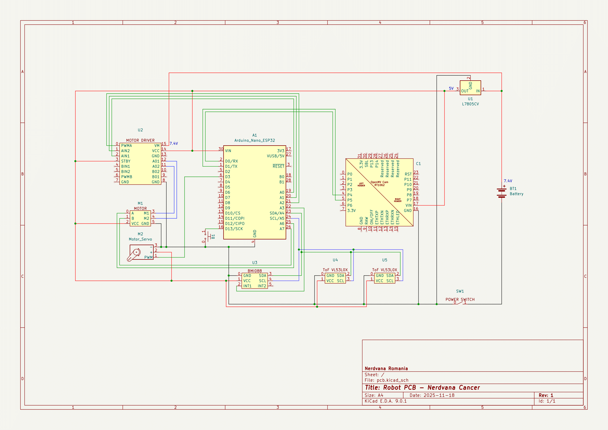

<br>

# Code for each component <a class="anchor" id="code-for-each-component"></a>

## Drive Motor <a class="anchor" id="drive-motor-code"></a>

The motor driver can be directly managed with a single PWM pin that adjusts the motor's speed and two digital pins designated for determining the motor's rotation direction. Consequently, the use of any external library for motor manipulation was unnecessary.

We devised two functions within our control system: one to modify the motor's velocity and another to halt it effectively, incorporating a braking feature. To achieve this, we convert the desired speed from our established scale of -100 to +100 to the PWM equivalent of 0 to 1023. The motor's direction is then adjusted according to the sign of the input value.

Given the fact that the Arduino has an ESP chip, the PWM signals have to be sent using the ```ledc``` utility.

```ino
void motor_driver_setup() {
  ledcSetup(DRIVER_PWM_CHANNEL, PWM_FREQ, PWM_RES);
  ledcAttachPin(PWMA, DRIVER_PWM_CHANNEL);

  pinMode(AIN1, OUTPUT);
  pinMode(AIN2, OUTPUT);
}

void move_motor(double speed) {  // move the motor with a given speed in the [-100, 100] interval
  int dir = 1;
  if (speed < 0) {
    dir = -1;
    speed *= -1;
  }
  else if (speed == 0) {
    dir = 0;
  }
  speed = map_double(speed, 0, 100, 0, 1023);
  if (dir == 1) { // move the motor forward
    digitalWrite(AIN1, HIGH);
    digitalWrite(AIN2, LOW);
  }
  else if (dir == -1) { // move it backwards
    digitalWrite(AIN1, LOW);
    digitalWrite(AIN2, HIGH);
  }
  else { // implement active break (not used since we don't know how reliable it is)
    digitalWrite(AIN1, LOW);
    digitalWrite(AIN2, LOW);
  }
  ledcWrite(DRIVER_PWM_CHANNEL, (int)speed); // write the speed using PWM
}

void motor_break(long long break_time) { // stop the robot for a given time
  move_motor(-3);
  custom_delay(break_time);
}
```

However, for the encoder, we required a specialized library to handle the more complex signal processing. The library we use for interfacing with the encoder is called ```Encoder.h```.

The encoder operates with a straightforward function that we found easy to comprehend and program. In order to determine the distance in cm, we divided the returned value by 12, since the encoder measures 12 counts per revolution. Then we multiplied this with the gear ratio, wheel diameter and Pi. After that we divided by 10 to convert to cm.

Because of the way the ESP32 chip interacts with the components, in order for this library to properly work, we should select the pin numbering option as "by GPIO number", not as the default "by Arduino pin".

```ino
double read_motor_cm() {  // getting the distance driven by the motor in cm
  return GEAR_RATIO * WHEEL_DIAM * M_PI * (double)myEnc.read() / 12 / 10;
}
```

## Servo Motor <a class="anchor" id="servo-motor-code"></a>

For controlling the servo motor, we utilize the ```Servo.h``` library, which provides the necessary functions to manage the servo's movements. Initially, we configure the servo by establishing its range, defining the maximum and minimum angles it can achieve in both directions. This ensures that we can accurately position the servo within its operational limits.

```ino
void servo_setup() {
  // attach the servo to the right pin and move it to the minimum and maximum angles
  // in the end, center the servo so that we start the program moving straight
  servo.attach(SERVO_PIN);
  for (int deg = servo.read() - 1; deg >= ANGLE_MIN; deg--)
    servo.write(deg);
  custom_delay(500);
  // Serial.println("after ANGLE_MIN");
  for (int deg = servo.read() + 1; deg <= ANGLE_MID; deg++)
    servo.write(deg);
  // Serial.println("after ANGLE_MID");
  for (int deg = servo.read() + 1; deg <= ANGLE_MAX; deg++)
    servo.write(deg);
  custom_delay(500);
  // Serial.println("after ANGLE_MAX");
  for (int deg = servo.read() - 1; deg >= ANGLE_MID; deg--)
    servo.write(deg);
  custom_delay(500);
  // Serial.println("after ANGLE_MID");
  goal_deg = ANGLE_MID;
}
```

The servo motor is controlled dinamically in the loop by setting a goal angle and taking small steps towards that goal at every iteration. This way we make sure that we can send a lot of fast angle changes to the servo and get the wanted results.

The function ```move_servo``` sets the goal angle to the given parameter. If the angle is negative the motor will rotate to the right, and if it is positive, the motor will rotate to left. This way, 0 is going to be the position in which the wheels are straight. Also, the values given the motor need to be between -1 and 1, so we use a clamp function to limit the value we are going to give the motor to rotate to and an interval mapping function to map the parameter from the [-1; 1] interval to the [ANGLE_MIN; ANGLE_MAX] interval.

The function ```update_servo``` takes a small step towards the goal angle as described above.

```ino
void move_servo(double angle) {  // move the servo to the angle checkpoint by setting the goal degrees to the angle value
  goal_deg = map_double(angle, -1, 1, ANGLE_MIN, ANGLE_MAX);
}

void update_servo() { // update the servo, making it closer to the goal angle by a small step
  int current_angle_servo = servo.read();
  if (abs(current_angle_servo - goal_deg) >= ANGLE_VARIANCE_THRESHOLD) { // if we're too far off, directly write the new angle
    servo.write(goal_deg);
  }
  else {
    // increment the angle with a small step in the right direction
    // making sure we don't exceed our angle limitations
    if (current_angle_servo < goal_deg) {
      servo.write(min(current_angle_servo + STEP, ANGLE_MAX));
    }
    else if (current_angle_servo > goal_deg) {
      servo.write(max(current_angle_servo - STEP, ANGLE_MIN));
    }
  }
}

void loop() {
  // other code
  update_servo();
}
```

## Camera <a class="anchor" id="camera-code"></a>

Now that we finished implementing the functions that we need to make the robot move and steer, we have to make it see the lines that trigger the turns, the cubes and the parking walls and move accordingly. To communicate with the camera, we use the ```UART``` protocol. In order for this to work, we must link the ```RX0``` pin on the arduino (the receiver pin) to the ```P4``` pin on the camera (the transmitter pin) and the ```TX1``` pin on the arduino (the transmitter pin) to the ```P5``` pin on the camera (the receiver pin). In addition, the baud rates from the ```Serial0``` object on the arduino and the ```uart``` object on the camera must match.

**Arduino code:**

```ino
void comm_setup() {
  Serial.begin(9600);
  // while(!Serial);
  blink_led(LED_BUILTIN, 500);

  Serial0.begin(19200);
  while(!Serial0); // wait for the serial to properly initialize
  blink_led(LED_BUILTIN, 500);
  receivedMessage = "";
}

void loop() {
  // execute pending commands
  while (Serial0.available() > 0) { // if we have some characters waiting
    char receivedChar = Serial0.read(); // we get the first character
    if (receivedChar == '\n') { // if it's the end of message marker
      if (CASE != PARK) { // if we want to execute commands
        execute(receivedMessage); // execute the received command from the OpenMV camera
      }
      receivedMessage = ""; // reset the received message
    }
    else {
      receivedMessage += receivedChar; // append characters to the received message
    }
  }
}
```

**Camera code:**

```py
# setup UART connection to arduino
uart = UART(3, 19200)
# 3 - the uart config, meaning that we use pins P4 as the transmitter, P5 as the receiver
# 19200 - baud rate aka frequency, must match the one set up on the arduino

# because we have a one-sided communication going on
# we can directly write messages without any supplementary checks
uart.write(msg)
```

In order to detect colors, we have to take pictures in which to search for colors. This is the sequence that sets up the camera sensor. Due to the limitations of the sensor, we couldn't manually adjust the white balance, gain, exposure time or access its registries.

```py
import sensor

# initialize the sensor
sensor.reset()
sensor.set_pixformat(sensor.RGB565)
sensor.set_framesize(sensor.QQVGA)
#sensor.set_framerate(40)
sensor.set_vflip(True)
sensor.set_hmirror(True)

# disable auto gain, white balance, and exposure
sensor.set_auto_gain(False)  # must be turned off for color tracking
sensor.set_auto_whitebal(False)  # must be turned off for color tracking
sensor.set_auto_exposure(False, exposure_us=10000) # set constant exposure for the best visibility

# skip some frames to let the camera adjust
sensor.skip_frames(time=2000)
```

Now for the camera logic, the color tracking is pretty simple: the camera can return blobs of pixels that fit into a certain ```LAB``` threshold representing a color. We can also restrain the blob detection to a rectangle of interest and apply pixel count, bounding rectangle area and density filters as well. The reason for which we do this, is that certain colors, like green, red, blue and orange are pretty common, therefore we don't want the camera to interpret clothes or other objects outside of the map as obstacles. In addition, the orange and red colors, in some light conditions, are quite similar. This is why we apply the pixel count, bounding rectangle area and density filters, to ensure that we are seeing the correct object.

For quali we firstly scan the color of the first seen line. This will give us the direction of the run. Then, we constantly look out for lines that are over a certain area. Once we find one, we send the turn trigger to the Arduino via ```UART```.

```py
while (True):
    clock.tick()
    img = sensor.snapshot()

    # find the coloured blobs corresponding to the turn lines
    orange_blobs = img.find_blobs(orange_threshold, roi=lines_roi, pixels_threshold=line_blob_size, area_threshold=line_blob_size, merge=True)
    blue_blobs = img.find_blobs(blue_threshold, roi=lines_roi, pixels_threshold=line_blob_size, area_threshold=line_blob_size, merge=True)

    orange_blob_w = None
    orange_blob_h = None
    max_width = 0
    max_height = 0
    for blob in orange_blobs:
        if blob.w() >= img.width() * 0.4: # if it meets the minimum width requirement
            if blob.w() > max_width: # if it's the biggest blob yet
                max_width = blob.w()
                orange_blob_w = blob # biggest blob on the width
        if blob.h() >= lines_roi[3] * 0.4: # if it meets the minimum height requirement
            if blob.h() > max_height: # if it's the biggest blob yet
                max_height = blob.h()
                orange_blob_h = blob # biggest blob on the height
    # if we have a blob meeting either the minimum width or height requirement we remember it
    orange_blob = orange_blob_w
    if not orange_blob:
        orange_blob = orange_blob_h

    blue_blob_w = None
    blue_blob_h = None
    max_width = 0
    max_height = 0
    for blob in blue_blobs:
        if blob.w() >= img.width() * 0.4: # if it meets the minimum width requirement
            if blob.w() > max_width: # if it's the biggest blob yet
                max_width = blob.w()
                blue_blob_w = blob # biggest blob on the width
        if blob.h() >= lines_roi[3] * 0.4: # if it meets the minimum height requirement
            if blob.h() > max_height: # if it's the biggest blob yet
                max_height = blob.h()
                blue_blob_h = blob # biggest blob on the height
    # if we have a blob meeting either the minimum width or height requirement we remember it
    blue_blob = blue_blob_w
    if not blue_blob:
        blue_blob = blue_blob_h

    if direction == 0: # if we didn't set a turn direction yet
        if orange_blob: # if the first line we saw was an orange one
            direction = 2
        elif blue_blob: # if the first line we saw was a blue one
            direction = 1

    has_line = False
    if orange_blob or blue_blob: # if we saw either coloured lines, we can make a turn
        has_line = True

    if has_line:
        # if we must turn, send the turn trigger
        uart.write(str(direction) + '\n')
```


## IMU <a class="anchor" id="gyro-sensor-code"></a>

To utilize the gyro sensor, we needed to include the ```BMI088.h``` library. During initialization, we allocate a 10-second window to measure the sensor's drift, allowing us to refine the robot's angular readings for greater precision. Additionally, we configure the sensor's output data rate to 400Hz and set the bandwidth to 47Hz. The bandwidth determines the frequency of data sampling by the sensor; a higher bandwidth yields more precise data at the cost of increased power consumption. We also designate pin A6 as an input and attach an interrupt to it, enabling us to capture data from the sensor as soon as it becomes available.

```ino
void gyro_setup(bool debug) {
  int status = accel.begin();
  status = accel.setOdr(Bmi088Accel::ODR_200HZ_BW_80HZ);
  status = accel.pinModeInt1(Bmi088Accel::PUSH_PULL,Bmi088Accel::ACTIVE_HIGH);
  status = accel.mapDrdyInt1(true);

  status = gyro.begin();

  status = gyro.setOdr(Bmi088Gyro::ODR_400HZ_BW_47HZ);
  status = gyro.pinModeInt3(Bmi088Gyro::PUSH_PULL,Bmi088Gyro::ACTIVE_HIGH);
  status = gyro.mapDrdyInt3(true);

  pinMode(INT_PIN,INPUT);
  attachInterrupt(INT_PIN,gyro_drdy,RISING);

  if(status < 0) {
    if(debug){
      Serial.print("BMI Initialization Error!  error: ");
      Serial.println(status);
    }
  }
  else  {
    // Gyro drift calculation
    if(debug) Serial.println("Starting gyro drift calculation...");

    gx = 0;
    // gy = 0;
    // gz = 0;

    gyro_last_read_time = millis();

    double start_time = millis();
    while(millis() - start_time < DRIFT_TEST_TIME * 1000) {
      gyro.readSensor();
      double read_time = millis();
      gx += (gyro.getGyroX_rads() * (read_time - gyro_last_read_time) * 0.001);
      // gy += (gyro.getGyroY_rads() * (read_time - gyro_last_read_time) * 0.001);
      // gz += (gyro.getGyroZ_rads() * (read_time - gyro_last_read_time) * 0.001);

      gyro_last_read_time = read_time;
    }

    drifts_x = gx / DRIFT_TEST_TIME;
    // drifts_y = gy / DRIFT_TEST_TIME;
    // drifts_z = gz / DRIFT_TEST_TIME;

    if(debug) Serial.print("Drift test done!\nx: ");
    if(debug) Serial.println(drifts_x, 6);
    // if(debug) Serial.print("   y: ");
    // if(debug) Serial.print(drifts_y, 6);
    // if(debug) Serial.print("   z: ");
    // if(debug) Serial.println(drifts_z, 6);
  }
  // Gyro value reset
  gx = 0;
  // gy = 0;
  // gz = 0;

  gyro_last_read_time = millis();
}
```

Within the ```read_gyro``` function, we're retrieving data from the gyro sensor and adjusting it to account for any detected drift, enhancing the accuracy of the readings. Since the gyro provides data in radians, a conversion to degrees is necessary for our application. We're focusing solely on the rotation around the x-axis, hence we only compute the ```gx``` value, which represents the robot's angular rotation in degrees on that specific axis.

```ino
void read_gyro(bool debug) {
  if(gyro_flag) {
    gyro_flag = false;
    gyro.readSensor();   
    double read_time = millis();

    gx += ((gyro.getGyroX_rads() - drifts_x) * (read_time - gyro_last_read_time) * 0.001) * 180.0 / PI;
    // gy += ((gyro.getGyroY_rads() - drifts_y) * (read_time - gyro_last_read_time) * 0.001) * 180.0 / PI;
    // gz += ((gyro.getGyroZ_rads() - drifts_z) * (read_time - gyro_last_read_time) * 0.001) * 180.0 / PI;

    gyro_last_read_time = read_time;

    if(debug) {
      Serial.print("Gyro: gx: ");
      Serial.println(gx);
      // Serial.print(" gy: ");
      // Serial.print(gy);
      // Serial.print(" gz: ");
      // Serial.println(gz);
    }
  }
}
```

<br>

# Obstacle Management <a class="anchor" id="obstacle-management"></a>

## Qualification Round <a class="anchor" id="quali-management"></a>

For the qualifying round, we set up a basic switch-case system to guide our robot. This system tells the robot what to do next, depending on where it is. The robot knows where it is by counting how many times it has turned.

We use two main switch cases: ```PID``` and ```STOP_QUALI```.

In the ```PID``` case, the robot moves straight and turns. It uses a special tool (PID controller) with a gyro sensor to stay on a straight line. If it sees a corner line, it gets a trigger from the camera to make a turn by adding 90 degrees to the goal angle.

```ino
case PID: {
  check_and_execute_turnaround(gx);
  double err = current_angle_gyro - gx;
  if (millis() - last_rotate > FIRST_STOP_DELAY && turns >= 12) { // if we did 3 runs of the round
    if (FINAL) {
      CASE = STOP_BEFORE_FIND_PARKING; // we need to stop and search for the parking
    }
    else {
      CASE = STOP_QUALI; // stop, challenge over
    }
  }
  else {
    // classic pid on the gyro so that we can move straight
    pid_error_gyro = (err) * kp_gyro + (pid_error_gyro - pid_last_error_gyro) * kd_gyro;
    pid_last_error_gyro = pid_error_gyro;
    move_servo(pid_error_gyro);
  }
  move_motor(MOTOR_SPEED);
  break;
}

case STOP_QUALI: {
  // we finished the challenge, stop the robot
  move_until_angle(MOTOR_SPEED, current_angle_gyro);
  move_cm_gyro(10, MOTOR_SPEED, current_angle_gyro);
  is_running = false;
  Serial.println("Stop case");
  motor_break(1000000000);
}
```

### Line Detection
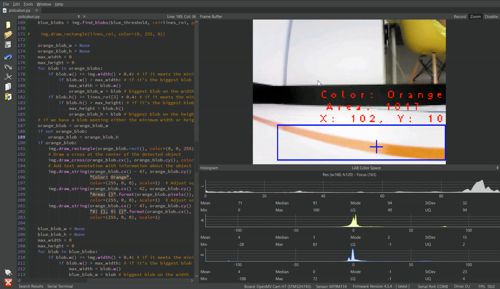

## Final Round <a class="anchor" id="final-management"></a>

For the final round, we based our controller algorithm on the quali code, adding a PID controller on the camera to follow the closest cube until it is in its proximity. In order to get the closest cube to the robot we just search for the biggest red or green coloured blob in the image.
After we're in the cube's proximity, we send a trigger from the camera to the arduino with the cube color so that we can start avoiding it.

```py
img = sensor.snapshot()

# find the coloured blobs corresponding to the cubes
red_blobs = img.find_blobs(red_threshold, roi=cubes_roi, pixels_threshold=min_cube_size, area_threshold=min_cube_size, merge=True)
green_blobs = img.find_blobs(green_threshold, roi=cubes_roi, pixels_threshold=min_cube_size, area_threshold=min_cube_size, merge=True)

msg = "0\n"
max_area = 0
color = 'none'
saved_cube = None
for blob in red_blobs: # for every red blob
    # if they're passing the height and density filters
    # we're keeping the biggest one and its color
    if is_cube(blob, orange_blob, parking_blobs) and blob.area() > max_area:
        max_area = blob.area()
        saved_cube = blob
        color = 'red'
for blob in green_blobs: # for every green blob
    # if they're passing the height and density filters
    # we're keeping the biggest one and its color
    if is_cube(blob, blue_blob, parking_blobs) and blob.area() > max_area:
        max_area = blob.area()
        saved_cube = blob
        color = 'green'

if saved_cube != None: # if we saw a cube
    # if the cube area is over a certain threshold
    # it means we must avoid the cube as we are too close to it
    if (color == 'red' and saved_cube.pixels() >= max_cube_size_red) or (color == 'green' and saved_cube.pixels() >= max_cube_size_green):
        # send the right trigger
        if color == 'red':
            uart.write('R\n')
        else:
            uart.write('G\n')
        if has_line:
            # if we must also turn, send the trigger
            uart.write(str(direction) + '\n') # send the turn trigger
    else: # if the cube isn't too big we must follow it
        # calculate the angle using PID
        err = saved_cube.cx() - img.width() / 2
        steering = err * kp + (err - err_old) * kd
        steering = -clamp(steering, -1, 1)
        err_old = err
        # craft the command
        if color == 'red':
            msg = 'r' + str(steering) + '\n'
        else:
            msg = 'g' + str(steering) + '\n'
        uart.write(msg) # send the message
        if has_line:
            # if we must also turn, send the turn trigger
            uart.write(str(direction) + '\n')
elif has_line: # if we don't see any cubes
    # if we must turn, send the turn trigger
    uart.write(str(direction) + '\n')
```

### Cube Detection
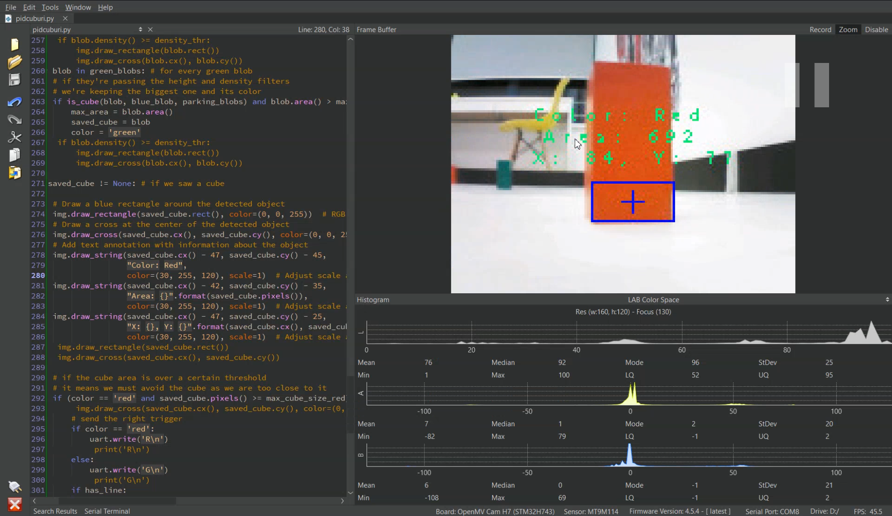
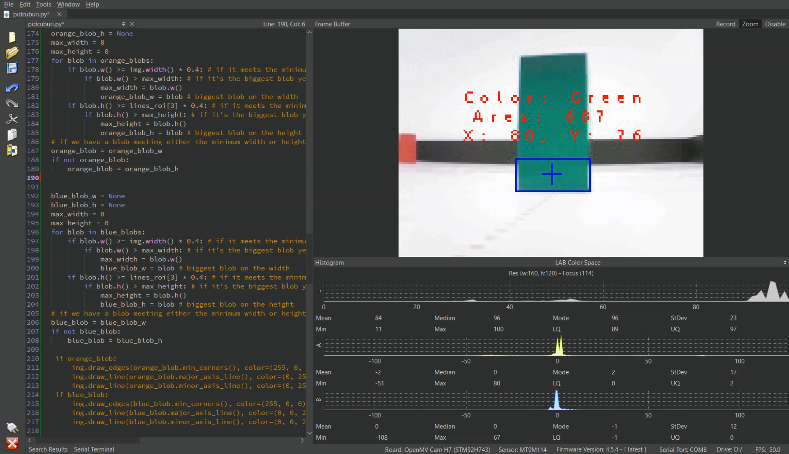

---

The arduino part is quite simple, consisting of the quali switch but with two extra cases: ```FOLLOW_CUBE``` and ```AFTER_CUBE```. In the ```FOLLOW_CUBE``` case we just write to the servo the steering angle calculated by the PID algorithm ran on the camera. After we get the proximity trigger from the camera, we have a custom function called ```pass_cube``` which steers us away from the cube and puts us in the ```AFTER_CUBE``` state. This case consists of two substates: in the first one the robot steers in the opposite direction to center itself again and the second one in which the robot uses a PID with the gyro to move an additional distance so that we're perfectly positioned to see the next cube. After that, we go back to the default ```PID``` case that is used in the quali code.

```ino
// hardcoded sequence that avoids a cube
void pass_cube(int cube_last) {
  int angle_addition = 0;
  if (cube_last == 1) // due to a slight asymmetry in the steering, when avoiding red cubes we need to steer less
    angle_addition = -9;
  read_gyro(false);
  int start_angle = gx;
  move_until_angle(MOTOR_SPEED, start_angle - cube_last * (AVOIDANCE_ANGLE + angle_addition)); // steer away from the cube
  // gain some distance
  if (abs(current_angle_gyro - start_angle) >= 10) // if we passed by it while crooked in regards to the goal line we need to overcompensate in order to see the next cube
    move_cm_gyro(16, MOTOR_SPEED, start_angle - cube_last * (AVOIDANCE_ANGLE + angle_addition));
  else
    move_cm_gyro(7, MOTOR_SPEED, start_angle - cube_last * (AVOIDANCE_ANGLE + angle_addition));
  CASE = AFTER_CUBE;
}
```

```ino
case FOLLOW_CUBE: {
  check_and_execute_turnaround(gx);
  if (millis() - last_rotate > FIRST_STOP_DELAY && turns >= 12) { // if we did 3 runs of the obstacle round, we need to stop and search for the parking
    CASE = STOP_BEFORE_FIND_PARKING;
  }
  else {
    if (millis() - last_follow_cube > FOLLOW_CUBE_DEAD_TIME) // if we lost the cube, we just go back to the default PID case
      CASE = PID;
    // write to the servo the pid computed on the camera in order to follow the cube
    move_servo(follow_cube_angle);
    move_motor(MOTOR_SPEED);
  }
  break;
}

case AFTER_CUBE: {
  check_and_execute_turnaround(gx);
  if (millis() - last_rotate > FIRST_STOP_DELAY && turns >= 12) { // if we did 3 runs of the obstacle round, we need to stop and search for the parking
    CASE = STOP_BEFORE_FIND_PARKING;
  }
  else {
    double err = current_angle_gyro - gx + cube_last * CORRECTION_ANGLE;
    if (abs(err) < 5) {
      // after we avoid the cube, move forward a bit more so that we're positioned
      // to see the next cube
      if (cube_last == turn_direction) // compensate less on the inside
        move_cm_gyro(5, MOTOR_SPEED, current_angle_gyro + cube_last * CORRECTION_ANGLE);
      else
        move_cm_gyro(10, MOTOR_SPEED, current_angle_gyro + cube_last * CORRECTION_ANGLE);
      CASE = PID;
    }
    else {
      // classic pid on the gyro so that we can move in the opposite direction
      // so that we can see the next cube
      pid_error_gyro = (err) * kp_gyro + (pid_error_gyro - pid_last_error_gyro) * kd_gyro;
      pid_last_error_gyro = pid_error_gyro;
      move_servo(pid_error_gyro);
    }
  }
  move_motor(MOTOR_SPEED);
  break;
}
```

The next challenge in this round consists in the final turnaround. If the last seen cube is red, we need to do a roundabout and complete the last lap in the opposite direction. The way we deal with this is a function that checks if we should turn around and executes it if necessary. This function is called in the ```PID```, ```FOLLOW_CUBE``` and ```AFTER_CUBE``` cases.

```ino
void check_and_execute_turnaround(double gx) {
  // if we didn't do the turnaround yet
  // and we did 2 runs of the map
  // and the last seen cube is red
  // and some time passed since the 8th turn
  // (so that we can see the first cube in the starting sequence in case this sequence had 2 cubes and we spawned between them)
  if (!FINAL)
    return;
  if (!TURNED && turns == 8 && cube_last == 1 && millis() - last_rotate > TURNAROUND_DELAY) { // may have to take out the time condition for any case except AFTER_CUBE
    move_until_angle(MOTOR_SPEED, current_angle_gyro + turn_direction * TURNAROUND_ANGLE);
    if (-cube_last == turn_direction) { // if i avoided the cube on the inside, i don't have too much room
      move_cm_gyro(5, MOTOR_SPEED, current_angle_gyro + turn_direction * TURNAROUND_ANGLE); // position ourselves so that we have room to turn around
    }
    else {
      move_cm_gyro(17, MOTOR_SPEED, current_angle_gyro + turn_direction * TURNAROUND_ANGLE); // position ourselves so that we have room to turn around
    }
    turn_direction *= -1;
    current_angle_gyro += turn_direction * 180;
    move_until_angle(MOTOR_SPEED, current_angle_gyro + turn_direction * TURNAROUND_ANGLE);
    TURNED = true;
    CASE = PID;
  }
}
```

The final challenge in this round consists in parking the robot. The way we implement this is based on the quali. Basically we want to move as close to the outer walls as possible so that we're perfectly positioned for the parking and avoid all of the cubes. How we achieve this is by going perpendicular to the outside walls after we finish the obstacle round (see the ```POSITION_BEFORE_FIND_PARKING``` case). The goal is to position ourselves as close as possible to them. After we receive a trigger from the camera saying that we're in its proximity, we straighten ourselves out and start the basic quali code.

While moving around the map like this (in the ```FIND_PARKING``` case), we are constantly scanning for magenta blobs that represent the parking walls. When we detect them, we send a trigger from the camera to the arduino and then we have a hardcoded sequence that puts us between the walls, perfectly parallel to them, implemented in the ```POSITION_FOR_PARK``` case. After that, we move straight in order to get closer to the outer wall (see the ```PARK``` case). When we receive the trigger from the camera, move a couple of cm straight and stop the robot.

Camera code:

```py
# find the coloured blobs corresponding to the parking walls
parking_blobs = img.find_blobs(parking_threshold, roi=parking_roi, pixels_threshold=parking_blob_size_min, area_threshold=parking_blob_size_min, merge=True)
parking_wall_blob = get_biggest_blob(parking_blobs)

# find the coloured blobs corresponding to the outside walls
wall_blobs = img.find_blobs(black_threshold, roi=wall_roi, pixels_threshold=wall_blob_size, area_threshold=wall_blob_size, merge=True)
outer_wall = get_biggest_blob(wall_blobs)

if is_parking_wall(parking_wall_blob):
    # if we saw the parking walls, send the parking trigger
    uart.write('P\n')
if wall_blobs:
    # if the wall is big enough, send a slightly different message that helps us when parking
    # if not, send the classic one
    if outer_wall.pixels() >= wall_roi_area and outer_wall.area() >= wall_roi_area:
        uart.write('WP\n')
    else:
        uart.write('W\n')
```

### Parking Wall Detection
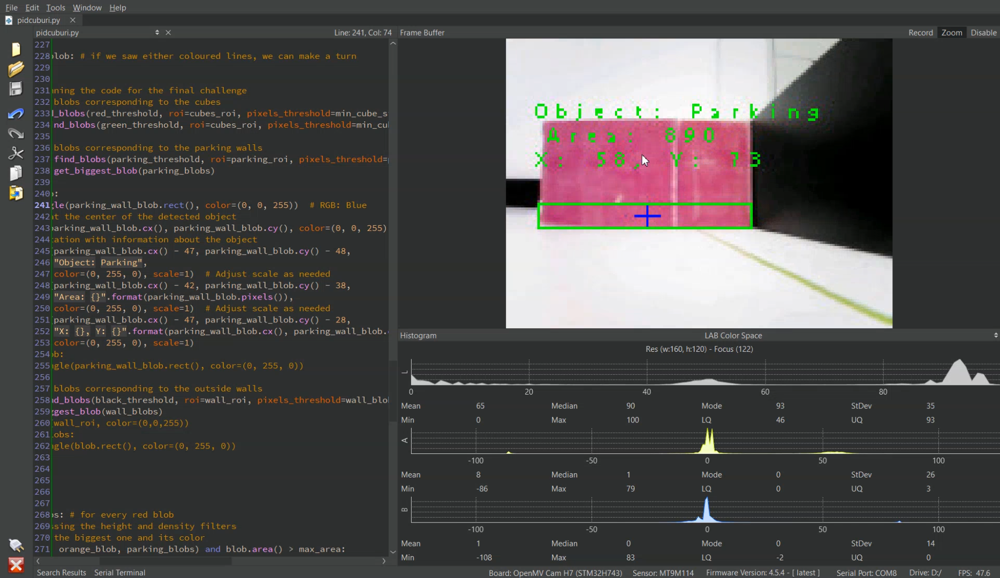

---

**Arduino code:**

```ino
case STOP_BEFORE_FIND_PARKING: {
  // straighten ourselves, start searching for the parking
  motor_break(1000);
  CASE = POSITION_BEFORE_FIND_PARKING;
  break;
}

case POSITION_BEFORE_FIND_PARKING: {
  // classic pid on the gyro so that we can move perpendicular to the walls
  // we don't just call the move_until_angle function so that we can still execute commands
  double err = current_angle_gyro - gx - turn_direction * 90;
  pid_error_gyro = (err) * kp_gyro + (pid_error_gyro - pid_last_error_gyro) * kd_gyro;
  pid_last_error_gyro = pid_error_gyro;
  move_servo(pid_error_gyro);
  move_motor(MOTOR_SPEED);
  break;
}

case FIND_PARKING: {
  // classic pid on the gyro so that we can move straight
  // basically immitating a quali run until we find the parking spot
  double err = current_angle_gyro - gx;
  pid_error_gyro = (err) * kp_gyro + (pid_error_gyro - pid_last_error_gyro) * kd_gyro;
  pid_last_error_gyro = pid_error_gyro;
  move_servo(pid_error_gyro);
  move_motor(MOTOR_SPEED);
  break;
}

case POSITION_FOR_PARK: {
  // hardcoded sequence of moves that positions us in the parking spot
  // after that, we just get closer to the outside wall so that we're fully in
  move_cm_gyro(10, PARKING_SPEED, current_angle_gyro);
  move_until_angle(PARKING_SPEED, current_angle_gyro + turn_direction * 90);
  move_until_angle(PARKING_SPEED, current_angle_gyro - turn_direction * 90);
  CASE = PARK;
  break;
}

case PARK: {
  // classic pid on the gyro so that we can move straight into the parking space
  // we don't just call the move_until_angle function so that we can still execute commands
  double err = current_angle_gyro - gx - turn_direction * 90;
  pid_error_gyro = (err) * kp_gyro + (pid_error_gyro - pid_last_error_gyro) * kd_gyro;
  pid_last_error_gyro = pid_error_gyro;
  move_servo(pid_error_gyro);
  move_motor(PARKING_SPEED);
  break;
}

case STOP_FINAL: {
  // we finished the challenge, stop the robot
  is_running = false;
  Serial.println("Stop case");
  motor_break(1000000000);
}
```

## Additional code <a class="anchor" id="additional-code"></a>

**Arduino code:**

In order to clean up the code, we designed some additional functions. Whenever we want to call locomotion functions or delay functions, functions that would break the continuity of the loop function, we must do two things to make sure everything keeps working: flush the characters sent by the camera (using the ```flush_messages``` function) and read the gyro data. That's why we implemented a custom delay function and our locomotion functions are a bit atypical.

```ino
void flush_messages() { // flushing messages like this so that we don't get sections of messages
  // improves the stability of the communication
  while (Serial0.available() > 0) { // if we have some characters waiting
    char receivedChar = Serial0.read(); // we get the first character
    if (receivedChar == '\n') { // if it's the end of message marker
      receivedMessage = ""; // reset the received message
    }
    else {
      receivedMessage += receivedChar; // append characters to the received message
    }
  }
}

void custom_delay(long long delay_time) { // delay function that flushes all of the data
  long long start_time = millis();
  while (millis() - start_time < delay_time) {
    read_gyro(false);
    flush_messages();
  }
}
```

Functions used for locomotion:
```ino
// makes the robot move until it reaches a certain gyro angle
void move_until_angle(double speed, double gyro_offset) {
  int sign = 1;
  if (speed < 0) // if we're moving backwards, we need to steer in the opposite direction
    sign = -1;
  read_gyro(false);
  double err = gyro_offset - gx;
  while (abs(err) >= 10) { // while the error is too big
    // pid on the gyro so that we're moving towards the goal angle
    read_gyro(false);
    err = gyro_offset - gx;
    pid_error_gyro = (err) * kp_gyro + (pid_error_gyro - pid_last_error_gyro) * kd_gyro;
    pid_last_error_gyro = pid_error_gyro;
    move_servo(pid_error_gyro * sign);
    update_servo();
    move_motor(speed);
    flush_messages();
  }
}

// makes the robot move a certain distance at a certain gyro angle
void move_cm_gyro(double dis, double speed, double gyro_offset) {
  double start_cm = read_motor_cm();
  int sign = 1;
  if (speed < 0) // if we're moving backwards, we need to steer in the opposite direction
    sign = -1;
  while (abs(read_motor_cm() - start_cm) < dis) { // while we haven't moved the requested distance
    // pid on the gyro so that we're moving at the correct angle
    read_gyro(false);
    double err = gyro_offset - gx;
    pid_error_gyro = (err) * kp_gyro + (pid_error_gyro - pid_last_error_gyro) * kd_gyro;
    pid_last_error_gyro = pid_error_gyro;
    move_servo(pid_error_gyro * sign);
    update_servo();
    move_motor(speed);
    flush_messages();
  }
}
```

Lastly, we receive multiple types of commands from the camera, from different triggers, to cube following and avoiding commands. All of these take various forms, therefore we need a function that parses every command and executes it. This is where the ```execute``` and ```valid_command``` functions come in handy. The ```execute``` function executes the command only if the ```valid_command``` function says it's valid.

```ino
bool valid_command(String cmd) { // function that checks the validity of a command received from the camera
  if (cmd == "")
    return false;
  if ('0' <= cmd[0] && cmd[0] <= '9') {
    if (cmd[0] > '2' || cmd[0] == '0')
      return false;
    if (cmd.length() != 1)
      return false;
  }
  if (cmd[0] == '+' || cmd[0] == '-' || cmd[0] == '.')
    return false;
  return true;
}

// function that parses a command and executes it
void execute(String cmd) {
  if (!valid_command(cmd))
    return;

  // the following sequence gets the number from the command (if available)
  int pos = 0, sign = 1;
  if (cmd[pos] == 'r' || cmd[pos] == 'g')
    pos++;
  // manually going over the signs since the .toDouble function wouldn't parse them on its own
  if (cmd[pos] == '+')
    sign = 1, pos++;
  else if (cmd[pos] == '-')
    sign = -1, pos++;
  double val = cmd.substring(pos).toDouble();

  if (FINAL) { // if we're in the final round
    if (CASE == FIND_PARKING && cmd[0] == 'P') { // if we're searching for the parking spot and we find it
      CASE = POSITION_FOR_PARK; // park the robot
      return;
    }

    if (cmd[0] == 'P') // if we see the parking slot, but we didn't finish the obstacle round we ignore it
      return;

    if (CASE == POSITION_BEFORE_FIND_PARKING && cmd[0] == 'W') { // if we're positioning ourselves close to the wall and we're in its proximity
      move_until_angle(MOTOR_SPEED, current_angle_gyro); // straighten ourselves
      CASE = FIND_PARKING; // start searching for the parking lot
      return;
    }

    if (CASE == PARK && (cmd[0] == 'W' && cmd[1] == 'P')) { // if we're positioning ourselves close to the wall and we're in its proximity
      move_cm_gyro(2, PARKING_SPEED, current_angle_gyro - turn_direction * 90); // position ourselves closer
      CASE = STOP_FINAL; // we finished the parking, stop
      return;
    }

    if (cmd[0] == 'W') // if we see the outer wall, but we don't need it we ignore it
      return;

    if (CASE != FIND_PARKING && CASE != POSITION_BEFORE_FIND_PARKING) {
      if (cmd[0] == 'R' || cmd[0] == 'G') { // if we're in the proximity of a cube
        if (cmd[0] == 'R') { // we determine the direction in which we avoid the cube
          cube_last = 1;
        }
        else {
          cube_last = -1;
        }
        pass_cube(cube_last);
        return;
      }
      if (cmd[0] == 'r' || cmd[0] == 'g') { // if we see a cube but we're not close enough to avoid it
        follow_cube_angle = val * sign;
        CASE = FOLLOW_CUBE;
        last_follow_cube = millis();
        return;
      }
    }
  }
  
  int msg = (int)val;
  if (msg) { // a turn was detected
    if (turn_direction == 0) { // if we don't know the direction yet
      if (msg == 1) { // blue line
        turn_direction = 1;
      }
      else { // orange line
        turn_direction = -1;
      }
    }
    if (millis() - last_rotate > delay_walls) { // if we can make a turn
      if (CASE == FIND_PARKING) { // if we're searching for the parking spot
        // if we're at the first turn, we have to move more in order to position ourselves close to the outer walls
        move_cm_gyro(CORNER_DISTANCE_PARKING, MOTOR_SPEED, current_angle_gyro);
      }
      else if (0 < (current_angle_gyro - gx) * turn_direction && (current_angle_gyro - gx) * turn_direction < 10) { // if we're during the obstacle round or in the quali and we're straight
        // position ourselves in order to not hit the walls
        if (FINAL)
          move_cm_gyro(CORNER_DISTANCE_FINAL, MOTOR_SPEED, current_angle_gyro);
        else
          move_cm_gyro(CORNER_DISTANCE_QUALI, MOTOR_SPEED, current_angle_gyro);
      }
      else if (CASE == AFTER_CUBE) { // if we're crooked after avoiding a cube we position ourselves for the turn
        if (-cube_last == turn_direction) { // if we passed by it in the turn's direction then we just need to straighted ourselves for more manuver room
          move_until_angle(MOTOR_SPEED, current_angle_gyro);
        }
        else {
          move_until_angle(MOTOR_SPEED, current_angle_gyro + turn_direction * 30);
          move_cm_gyro(7, MOTOR_SPEED, current_angle_gyro + turn_direction * 30);
        }
        CASE = PID;
      }
      current_angle_gyro += turn_direction * 90; // update the goal angle for the next sequence
      turns++; // increase the number of turns made
      delay_walls = 2500; // larger delay for every turn except the first one
      // as we may have the starting position close to the first turn
      last_rotate = millis(); // update the last time we turned
    }
  }
}
```

**Camera code:**

In order to make the robot more stable in any light conditions, we had to make sure that the red, orange and magenta, respectively the green and the blue colors don't get confused in the color detection process. That's why in order to ensure the best accuracy we fine tuned our color thresholds so that we can never see magenta/orange on a red cube or blue on a green cube. The problem that remained is that we saw red in magenta/orange and green in blue. That's why we came up with a simple solution: if a red/green blob is inside another blob that can be mixed up with, such as a line blob or a parking wall blob, we simply ignore it, as it is a false cube detected.

```py
# detects if a blob is partially inside another blob
# by checking if the center of one blob is inside the minimum area rectangle that wraps the other blob
# giving the fact that this rectangle may be crooked, we have to use a special algorithm
# that is designed to check whether a point is inside a polygon or not based on the coordinates
def is_blob_in_blob(blob, blob2):
    if not blob2:
        return False
    polygon = blob2.min_corners()
    num_vertices = len(polygon)
    (x, y) = (blob.cx(), blob.cy())
    inside = False

    # store the first point in the polygon
    (p1x, p1y) = (polygon[0][0], polygon[0][1])

    # loop through each edge in the polygon
    for i in range(1, num_vertices + 1):
        # get the next point in the polygon
        (p2x, p2y) = (polygon[i % num_vertices][0], polygon[i % num_vertices][1])

        # check if the point is above the minimum y coordinate of the edge
        # check if the point is below the maximum y coordinate of the edge
        # check if the point is to the left of the maximum x coordinate of the edge
        if y > min(p1y, p2y) and y <= max(p1y, p2y) and x <= max(p1x, p2x):
            # calculate the x-intersection of the line connecting the point to the edge
            x_intersection = (y - p1y) * (p2x - p1x) / (p2y - p1y) + p1x

            # check if the point is on the same line as the edge or to the left of the x-intersection
            if p1x == p2x or x <= x_intersection:
                # flip the inside flag
                inside = not inside

        # store the current point as the first point for the next iteration
        (p1x, p1y) = (p2x, p2y)

    # return the value of the inside flag
    return inside

# checks whether a blob is a cube or not based on the minimum height and density filters
# as well as another check:
# since in some light conditions the red the cube may be similar to the orange line or magenta parking walls
# and in some light conditions the green the cube may be similar to the blue line
# we have to check if the possible cube blob is inside any of these ones
# if it is, then it may just be a false alarm and we should ignore it
def is_cube(blob, line_blob, parking_blobs):
    if blob.density() >= density_thr and blob.h() > min_cube_height and not is_blob_in_blob(blob, line_blob):
        for parking_wall_blob in parking_blobs:
            if is_blob_in_blob(blob, parking_wall_blob):
                return False
        return True
    return False
```

In addition, we created the following functions in order to avoid code repetition or to break down complicated conditions.

```py
# function that gets the biggest blob by size
def get_biggest_blob(blob_array):
    max_area = 0
    max_blob = None
    for blob in blob_array:
        # we're keeping the biggest parking blob
        if blob.area() > max_area:
            max_area = blob.area()
            max_blob = blob
    return max_blob

# checks if a parking wall blob meets the height and size requirements
def is_parking_wall(blob):
    if not blob:
        return False
    if blob.pixels() >= parking_blob_size_trigger and blob.area() >= parking_blob_size_trigger:
        return True
    if blob.h() >= parking_blob_height_trigger:
        return True
    return False
```

<br>

# What We Changed This Year <a class="anchor" id="whats-new"></a>

The mechanical robot above is basically the L.A.C.H.E. we ended last season with, and we were happy with it, so this year almost all of our work went into the software. The strategy in the two sections above (the switch-case quali run and the cube-following final) is still the backbone of how the robot competes. What follows is everything we built on top of it: a way to actually see what the robot is thinking, a gyro that no longer drifts, a car that calibrates its own steering, and the start of a localization system that lets us drive the track from memory instead of reacting to it corner by corner.

A note before the WiFi part, because it matters: **WiFi is a pit tool, not a race tool.** During an official run the radio is off and the robot is completely on its own (the camera still talks to the Arduino over UART, exactly like before). Everything described here that uses WiFi is something we use on the bench to tune and to understand the robot faster, and then we turn it off and let the calibrated values do the work.

## Tuning and telemetry over WiFi <a class="anchor" id="wifi-dashboard"></a>

Last year, tuning meant plugging in a USB cable, opening the serial monitor, changing a number, re-flashing, and unplugging again, for every single value. With a car that has to be put back on the floor to actually test anything, that loop was painfully slow.

So this year the Arduino Nano ESP32 doubles as its own WiFi access point. It starts a little network called `ROBOT_Fut`, serves a single web dashboard, and pushes live data to the browser over a WebSocket about twenty times a second. From a phone or a laptop, with the robot running on its battery on the floor, we can watch the heading, the steering angle, the encoder distance and the live camera view, and we can nudge any of the tuning parameters and see the effect immediately, no cable, no re-flash.

```ino
void setup() {
  // ... sensors and actuators set up first ...

  WiFi.mode(WIFI_AP);
  WiFi.softAP(AP_SSID, AP_PASS);              // "ROBOT_Fut" / "futeng2026"

  ws.onEvent(onWsEvent);                      // commands come back from the page
  server.addHandler(&ws);
  server.on("/", HTTP_GET, [](AsyncWebServerRequest *r) {
    r->send_P(200, "text/html", INDEX_HTML);  // the dashboard lives in flash
  });
  server.begin();
}

void loop() {
  // push a small JSON telemetry packet to every open browser, ~20 Hz
  if (millis() - lastPush >= 50) {
    lastPush = millis();
    if (ws.count() > 0) ws.textAll(telemetry());
  }
}
```

The same page also embeds the camera's own live stream. The OpenMV cam runs a tiny server that sends the raw image, and all the heavy color-tuning (picking a region, averaging the LAB values, previewing the mask) happens in the browser on the laptop, not on the camera. The camera just stores whatever thresholds we settle on into a small `thresholds.json` that the run code reads at startup. Calibrating colors went from "re-flash and pray" to dragging a box on a live image.

```py
# on the OpenMV cam: stream the frame, keep the tuned colors
def handle_save(query):           # GET /save?g=...&r=...
    thr = parse_thresholds(query)
    with open("thresholds.json", "w") as f:
        json.dump(thr, f)         # the robot reads these back at boot
    return "ok"
```

This one change is the reason everything below got built: once you can *see* the robot's numbers in real time, the bugs and the bad calibrations that used to hide for hours become obvious in minutes.

## A drift-free gyro that finds its own straight <a class="anchor" id="self-straight"></a>

The gyro has always been the heart of how we drive straight, but last year it had a weakness. At boot we measured its drift once over ten seconds and then trusted that number for the whole run. It worked, but the bias of a MEMS gyro moves a little as the chip warms up, so by the third lap the heading had quietly walked off by a couple of degrees, and a couple of degrees is the difference between a clean lap and clipping a wall.

This year we rebuilt the gyro pipeline. The BMI088 now streams at 1000 Hz and raises a data-ready interrupt on every new sample, so the heading is integrated from a steady, high-rate stream the moment each reading lands, instead of whenever the main loop happened to get around to it. More importantly, the drift correction never stops: whenever the readings are quiet enough that the car is clearly standing still, we keep nudging the measured drift towards what the sensor reports. It's a continuous zero-rate update, and the effect is that the heading basically stops drifting, over a full run it stays within about a tenth of a degree.

```ino
// fires on every new gyro sample (data-ready interrupt), ~1000 Hz
void read_gyro(bool debug) {
  if (gyro_flag) {
    gyro_flag = false;
    gyro.readSensor();
    double read_time = millis();
    double rate = gyro.getGyroX_rads();   // raw turn rate, rad/s

    // continuous zero-rate update: while the car is clearly standing still,
    // keep nudging the measured drift towards the true zero
    if (fabs(rate - drifts_x) < STILL_RATE_THRESH) still_count++;
    else still_count = 0;
    if (still_count >= STILL_SAMPLES)
      drifts_x += ZRU_ALPHA * (rate - drifts_x);

    // integrate the bias-corrected rate into a heading, in degrees
    gx += (rate - drifts_x) * (read_time - gyro_last_read_time) * 0.001 * 180.0 / PI;
    gyro_last_read_time = read_time;
  }
}
```

A solid heading is only half of going straight, though. The other half is the steering: the servo center that actually makes the wheels point dead ahead is never a clean number, it shifts with backlash, with how the linkage settled, even with a fresh battery pushing the motor a touch harder. We used to find it by eye, write it down as `ANGLE_MID`, and re-trim it by hand whenever something changed.

Now the car finds it on its own, by training on its own driving. We lock the steering at a candidate center, drive a fixed distance forward at race speed, and read how far the gyro says we drifted. That drift *is* the error: if the car curved right, the center is too far right. So we treat "find the center that gives zero drift" as a simple root-finding problem and let a secant search walk the center value towards zero error, usually in four or five passes, then do one verification run to confirm. Between passes the car drives itself back to the start, keeping straight with the gyro, so it can repeat the test without us touching it.

```ino
// drive forward with the steering locked at C, return the net heading drift
float measureForward(int C) {
  servo.write(C);
  gyroZero();
  setMotor(+g_speed);
  while (distanceDriven() < g_distCm) { /* log heading vs distance */ }
  setMotor(0);
  return g_heading;          // this is our error signal: 0 = perfectly straight
}

// secant step: use the last two (center, drift) points to guess the next center
float nextCenter(float C, float drift, float Cprev, float driftPrev) {
  float denom = drift - driftPrev;
  if (fabsf(denom) < 1e-3f) return C + PROBE_STEP;     // nudge if it's flat
  return C - drift * (C - Cprev) / denom;              // aim straight at zero
}
```

Every pass, the measured drift and the next center it's going to try show up live on the dashboard, so we can watch it converge. The first time we ran it and the number it landed on beat the one we'd been setting by hand for weeks, that was the moment this season clicked.

## Our own localization and route memory <a class="anchor" id="self-localization"></a>

Here is the bigger idea we've been chasing this year. A drift-free heading and a wheel encoder are, together, enough to know roughly *where the robot is on the mat*, not just which way it's pointing. So we built our own little localization: dead reckoning. Every time the encoder ticks, we know how far the wheels turned; combine that with the heading and you can integrate a position in centimeters.

```ino
// dead reckoning: turn the distance the wheels rolled + heading into (x, y)
void update_odometry() {
  double cm = read_motor_cm();
  double dd = cm - last_odo_cm;     // distance the wheels rolled since last call
  last_odo_cm = cm;

  double th = gx * DEG_TO_RAD;      // gx is our drift-free heading, in degrees
  robot_x += dd * sin(th);
  robot_y += dd * cos(th);

  // drop a breadcrumb every ~1.5 cm so we can rebuild the line we drove
  double ex = robot_x - last_log_x, ey = robot_y - last_log_y;
  if (ex * ex + ey * ey >= TRAIL_STEP_CM * TRAIL_STEP_CM && path_len < MAX_PATH) {
    path[path_len++] = { (float)robot_x, (float)robot_y, (float)gx, 0 };
    last_log_x = robot_x; last_log_y = robot_y;
  }
}
```

The dashboard draws this as a top-down map: the robot as an arrow, the route as a trail behind it, a grid in centimeters. We can drive the car around by holding a button on the page and literally watch the map of the track build itself. When we like a lap, we save the whole trajectory to a CSV right on the robot and pull it off over WiFi.

We're honest about the limits, because they shape everything: our encoder only has one working channel, so the *direction* of travel comes from the motor command rather than the wheels, and any sideways slip slowly accumulates into the position estimate. That means raw dead reckoning can't be trusted for a whole multi-lap run on its own. Our answer is to keep it anchored: the camera already finds the orange and blue corner lines and the walls every frame, and those are fixed, known features of the mat, so we use them to re-zero the position at each corner instead of letting the error pile up.

```py
# camera already detects the corner lines; now we also tag *where* it happened
if has_line:
    send_message(str(direction))   # same turn trigger as before
    send_message('M')              # ...plus "mark this corner on the map"
```

This is also where the camera stops being just an obstacle detector and starts shaping a clean racing line. Reacting to a corner only once you see the line gives you a late, abrupt turn. But if you've driven the track once and *recorded* the smooth line through every corner, you can drive the rest of the run from that memory, the corners come out rounded and repeatable because you're replaying a good lap instead of improvising a new one each time. Recording that line works well today; replaying it through the steering is the piece we're actively tuning, and it's the direction the whole project is pointed.

## Rethinking the parking <a class="anchor" id="smart-parking"></a>

Last year's parking (in the final round above) was clever but completely reactive: drive along the wall, wait until the camera sees the magenta markers, then run a hardcoded slot-in sequence and hope we were positioned well. When it worked it looked great; when the approach angle was a little off, the hardcoded part inherited that error and we'd end up crooked in the pocket.

With localization, parking turns into something we can actually reason about. The parking pocket is at a fixed place relative to the outer walls, so once we know our own position on the mat we know roughly where the pocket is *before* the camera even confirms it. The plan we're building for this season is to treat the pocket as a known waypoint: drive there on the recorded line, line up parallel using the gyro heading we trust, and only use the camera for the final centimeters of fine alignment against the magenta markers, instead of leaning on the camera for the entire maneuver. The hardcoded sequence stops being a leap of faith and becomes a short, well-positioned correction.

## Where this is heading <a class="anchor" id="next-steps"></a>

Everything above is one connected bet: that the most reliable way around this track is to *know where you are* and *drive a line you've already proven*, rather than to react frame by frame. The pieces we're proud of, drift-free heading, self-calibrating steering, live tuning, and live localization, are all working. The pieces we're still fighting with are the ones that turn a recorded path back into smooth motion: tightening the dead-reckoning so it survives a full run between corner re-zeros, and closing the loop so the steering follows the saved line instead of just plotting it.

If we get there, the qualification run becomes "drive one careful lap, then replay it faster," and the final becomes "replay the line, but bend around the cubes the camera reports." That's the robot we want to bring to the table this year, and for the first time it doesn't feel out of reach.

<br>

# Robot Construction Guide <a class="anchor" id="robot-construction-guide"></a>

## Step 0: Print the 3D parts <a class="anchor" id="3d-printing"></a>

The part files can be found in the `3d-models` folder. We used and recommend the [BambuLab X1-Carbon](https://bambulab.com/en/x1) 3D printer, with the following settings:
 - Material: PLA-CF
 - Layer height: 0.2mm
 - Infill: 20%
 - Supports: Yes
 - Raft: No
 - Brim: Yes

## Step 1: Assemble the steering system <a class="anchor" id="steering-system-assembly"></a>

1. Mount the `servo` on the `chassis` using 2 zip ties, make sure to cut the excess of the zip ties so it doesnt interfere with the steering arm.

2. Attach the `steering column` to the `servo` using a ⌀ 2mm metal rod, approximately 4mm in length.

3. Attach the `tie rod` to the `steering column` using a ⌀ 2mm metal rod, 10mm in length.

4. Hold the `steering knuckles` between the `chassis` and the `tie rod` and attach them with two ⌀ 2mm metal rod, 10mm in length.

6. Attach the `wheels` to the `steering knuckles` using 3mm d-shaft rods, approximately 15mm in length.

## Step 2: Assemble the powertrain <a class="anchor" id="powertrain-assembly"></a>
1. Attach the `motor` to the `chassis` using the `motor bracket` and *M3* screws.

3. On the `motor`, attach the `24tooth spud gear`.

4. The differential should have 3 `Gear 12 Tooth Bevel`(<a href="https://www.bricklink.com/v2/catalog/catalogitem.page?P=6589#T=C">6589</a>) inside it. Hold the `differential` in the designated stop at the back of the chassis, attach it using lego `Axles 3L`. Insert the 2 `powertrain` parts on each `Axles 3L`. Insert a `15mm D-shaft rod` on each of the `powertrain` parts. Put the `wheels` on the `D-shaft rods`.

## Step 3: Attach the electronics <a class="anchor" id="electronics-attachment"></a> 

1. Solder the components on the `pcb` according to the `electrical diagram`. We recommend using soldering sockets for the `Arduino` and the `motor driver` so that they can be easily removed if needed.

2. Place the `battery` in the place provided in the `chassis`.

3. Attach the `IMU` to the `chassis` using screws. Soulder a wire on the `IMU` on the `INT1` pin.

4. Screw the `pcb` to the `chassis` using *M3* screws, using `10 mm spacers` in the front.

5. Attach the `camera mount` to the `chassis` using screws.

6. Attach the `camera bracket` to the `camera mount` using screws.

5. Attach the `camera` to the `camera mount` using screws. Angle the `camera` slightly downwards so that it has a better view of the ground in front of the robot.

6. Connect all the wires according to the `electrical diagram`. The `camera` should be connected to the `Arduino` using the `UART` protocol. The `IMU` should be connected to the `Arduino` using the `I2C` protocol. The wires can be store bought, or you can make them yourself. We custom-made our wires to achieve the exact lengths needed and combined certain connections into single Dupont connectors—for example, the camera power, camera UART, and IMU I2C wires are each grouped within individual Dupont connectors.

7. (Optional) All the wires that are longer than needed can be wrapped arrond the `chassis` to make the robot look cleaner. You can use zip ties to secure the wires in place.

## Step 4: Upload the code <a class="anchor" id="code-upload"></a>

1. Connect the `Arduino` to your computer using a USB cable.

2. Open the `Arduino IDE` and install the ESP32 board manager.

3. Upload the code to the `Arduino`.

4. Connect the `OpenMV Cam` to the your computer using a USB cable.

5. Open the `OpenMV IDE` and upload the code to the `OpenMV Cam`.

<br>

# Cost Report <a class="anchor" id="cost-report"></a>

## Components <a class="anchor" id="components-cost"></a>

| Component                                   | Quantity | Cost per Unit (€) | Total (€) |
|---------------------------------------------|----------|--------------------|-----------|
| 30:1 Micro Metal Gearmotor HPCB 12V         | 1        | 21.00             | 21.00     |
| SparkFun Motor Driver - Dual TB6612FNG      | 1        | 13.00             | 13.00     |
| Motor Servo MG90S                           | 1        | 4.00              | 4.00      |
| LiPo Battery (450mAh, 7.4V, 30C)            | 1        | 9.00              | 9.00      |
| Arduino Nano ESP32                          | 1        | 24.00             | 24.00     |
| Grove - 6-Axis Accelerometer & Gyroscope    | 1        | 26.50             | 26.50     |
| OpenMV Cam RT1062                           | 1        | 105.50            | 105.50    |
| PCB                                         | 5        | 2                 | 10.00     |
| Metal Rods (2mm diameter, various lengths)  | 6        | 0.50              | 3.00      |
| Pololu      Wheels                          | 2        | 10.00             | 20.00      |
| Lego Gear 12 Tooth Bevel (6589)             | 3        | 0.50              | 1.50      |
| Lego Axles 3L                               | 2        | 0.60              | 1.20      |

**Total for Components:** **€238.70**

---

## 3D Printing Costs <a class="anchor" id="3d-printing-costs"></a>

- **Filament Used:**
  - Prototypes: 500g of PLA filament
  - Final Parts: 40g of PLA-CF filament
- **PLA-CF Filament Cost:** €32.00 per 1kg
- **PLA Filament Cost:** €25.00 per 1kg

| Filament Use      | Weight (g) | Cost (€) |
|--------------------|------------|----------|
| Prototypes         | 500        | 12.50    |
| Final Parts        | 40         | 1.28     |

**Total for 3D Printing:** **€27.56**

---

## Other Parts Tested <a class="anchor" id="other-parts-tested"></a>

- **Approximate Cost for Additional Parts Tested:** €150.00

---

## Tools and Equipment <a class="anchor" id="tools-and-equipment"></a>

| Tool                                   | Cost (€) |
|----------------------------------------|----------|
| Bambu Lab X1 Carbon 3D Printer         | 1,100.00 |
| Soldering Kit                          | 46.00    |
| Multimeter                             | 28.00    |
| Miscellaneous Tools (e.g., pliers)     | 19.00    |

**Total for Tools and Equipment:** **€1,193.00**

---

## Summary of Costs <a class="anchor" id="summary-of-costs"></a>

| Category               | Total (€) |
|------------------------|-----------|
| Components             | 238.70    |
| 3D Printing            | 13.78     |
| Other Parts Tested     | 150.00    |
| Tools and Equipment    | 1,193.00  |
| Shipping Approximation | 100.00    |

**Grand Total:** **€1,695.48**

---

*Note: Costs are approximate and based on current exchange rates and market prices.*

<br>

# Randomizer <a class="anchor" id="randomizer"></a>

To ensure the robot's ability to adapt to any course, we developed a randomizer that generates a random sequence of colors and positions for the cubes. You can find this web application at the following link: https://nerdvana.ro/wro-fe/

<br>

# Resources <a class="anchor" id="resources"></a>

## Images <a class="anchor" id="images-resources"></a>
<li> DC Motor - https://a.pololu-files.com/picture/0J10610.1200.jpg?204e9b873c23906503616db5c4950010
<li> MG90S Servo motor - https://www.robotistan.com/tower-pro-mg90s-micro-servo-motor-continuously-rotating-37080-99-B.jpg
<li> Sparkfun Motor Driver - https://cdn.sparkfun.com//assets/parts/1/2/4/8/2/14450a-01.jpg
<li> Arduino Nano ESP32 - https://ardushop.ro/7735-thickbox_default/arduino-nano-esp32-with-headers.jpg
<li> OpenMV Cam RT1062 - https://openmv.io/cdn/shop/files/cam-v5-front-hero-2-web_1000x.jpg?v=1699323324
<li> LiPo Battery - https://hpi-racing.ro/29739-medium_default/acumulator-lipo-gens-ace-g-tech-soaring-450mah-74v-30c-2s1p-cu-jst-syp.jpg
<li> Grove BMI088 Gyroscope - https://files.seeedstudio.com/wiki/Grove-6-Axis_Accelerometer-Gyroscope-BMI088/img/main.jpg
<li> Linear voltage regulator - https://m.media-amazon.com/images/I/71gro1yTESL._SL1500_.jpg
<li> Pololu Wheels - https://www.tme.eu/ro/details/pololu-1127/accesorii-pentru-robotica-si-rc/pololu/?brutto=1&currency=RON&gad_campaignid=10591401989

<br>

## Copyright <a class="anchor" id="copyright"></a>

```
MIT License

Permission is hereby granted, free of charge, to any person obtaining a copy of this software and associated documentation files (the "Software"), to deal in the Software without restriction, including without limitation the rights to use, copy, modify, merge, publish, distribute, sublicense, and/or sell copies of the Software, and to permit persons to whom the Software is furnished to do so, subject to the following conditions:

The above copyright notice and this permission notice shall be included in all copies or substantial portions of the Software.

THE SOFTWARE IS PROVIDED "AS IS", WITHOUT WARRANTY OF ANY KIND, EXPRESS OR IMPLIED, INCLUDING BUT NOT LIMITED TO THE WARRANTIES OF MERCHANTABILITY, FITNESS FOR A PARTICULAR PURPOSE AND NONINFRINGEMENT. IN NO EVENT SHALL THE AUTHORS OR COPYRIGHT HOLDERS BE LIABLE FOR ANY CLAIM, DAMAGES OR OTHER LIABILITY, WHETHER IN AN ACTION OF CONTRACT, TORT OR OTHERWISE, ARISING FROM, OUT OF OR IN CONNECTION WITH THE SOFTWARE OR THE USE OR OTHER DEALINGS IN THE SOFTWARE.

© 2026 Nerdvana Romania
```
